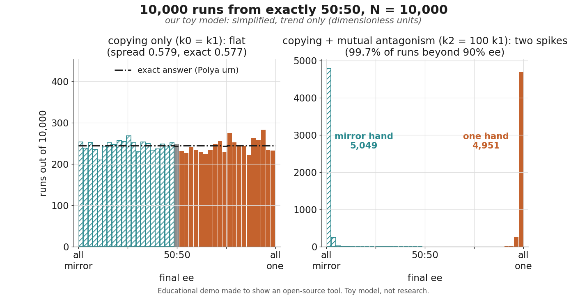
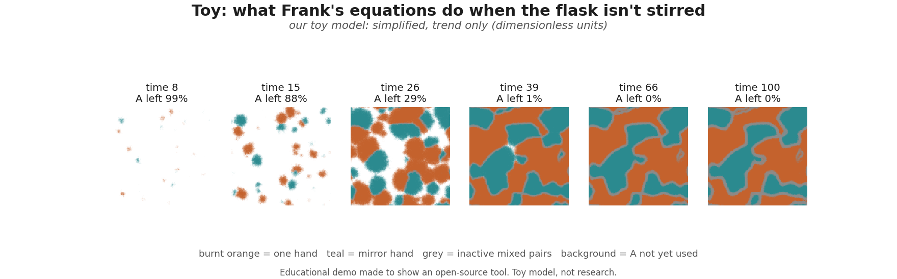

# Mirror race (Chemistry 2026, experiment 1)

> **Educational demo made to show an open-source tool. Toy model, not research.**
> Every number on this page is **our toy model, trend only**, in dimensionless model units. None of it
> reproduces, explains or validates the real Soai reaction or the origin of life.

The 2026 Nobel Prize in Chemistry went to Henri B. Kagan and Kenso Soai "for the discovery of non-linear effects
and autocatalysis in asymmetric organic synthesis". Many molecules come in two mirror-image forms, like a left and a
right hand. Ordinary chemistry makes both hands 50:50. In 1953 the physicist F. C. Frank wrote down a simple set of
reactions that can instead end up with almost only one hand, with chance alone picking which. Soai's reaction was the
first real reaction to behave in this way ("the first successful laboratory experiment to verify the Frank
model", Nobel Committee, scientific background p. 13).

This folder runs Frank's reactions molecule by molecule, thousands of times, starting from an **exactly** 50:50 world
(not one molecule of either hand), and asks: which hand wins, and how often?

Own code, MIT licence. CPU only. Python 3.11 with NumPy, SciPy, Matplotlib.

## Run it

From `2026/chemistry/mirror-race/`:

```bash
python3.11 -m venv .venv && . .venv/bin/activate && pip install -r requirements.txt
python -m mirrorrace.run_all            # everything: about 3 minutes, 4 processes
python -m mirrorrace.run_all --quick    # same main results, smaller head-start sweep: about 20 seconds
python -m pytest -q tests               # 12 tests, about 10 seconds
```

## The answers (our toy model, trend only)

N = 10,000 molecules of the starting material A, 10,000 runs per case, zero of each hand at the start.

| question | our toy model says (trend only) |
|---|---|
| **1. Copying only** (each hand makes more of itself, nothing else). What final mix do you get? | **anything, equally often**: the histogram of final ee is flat (exactly flat only for our choice k0 = k1; at k0/k1 = 0.1 the exact answer puts 75 % of copy-only runs beyond 90 % ee; at k0/k1 = 10 they stay near 50:50, spread 0.22). Spread (standard deviation) 0.579; the exact answer is 0.577. A test against the exact answer finds nothing wrong (p = 0.66). One hand ends ahead in 4,981 runs of 10,000 |
| **2. Copying + mutual antagonism** (one hand and its mirror hand also pair up and stop working). | **two spikes**: 99.7 % of runs end beyond 90 % ee (k2 = 100, tuned; k2 = 10 gives 60 %), almost all one hand or almost all mirror hand. One hand wins 4,951 times, the mirror hand 5,049 times: a fair coin (p = 0.33) |
| **3. The same runs, read early** (after 5 % of A is used up) | **partial values**: median ee 82 %, and 90 % of runs lie between 19 % and 98 % (our toy model, trend only; not fitted to any experiment) |
| **4. The real coin tosses** | Soai 2003: 37 runs, 19 one hand (S), 18 mirror hand (R), ee 15-91 %. Singleton and Vo 2003: 54 runs, 27 and 27. Both are consistent with a fair coin (p = 1.00 each) |
| **5. A head start.** How many extra molecules of one hand make it win 90 % of the time? | in this toy, **2 to 3 molecules**, the same for N = 1,000, 10,000 and 100,000. That number comes from how slow the toy's background step is, so it says nothing about a real flask (see below) |

ee (enantiomeric excess) = (one hand − mirror hand) / all product, from −100 % (all mirror hand) through 0 (50:50)
to +100 % (all one hand). We count the molecules locked in mixed pairs too (each pair is one of each hand).

<p align="center">
  <picture>
    <source media="(prefers-color-scheme: dark)" srcset="results/histograms_dark.png">
    
  </picture>
</p>

## What the model is

Five reactions, in model units (Frank 1953; the closed-flask version of Crusats, Hochberg, Moyano and Ribó 2009):

| step | what happens | rate (chance per unit time) |
|---|---|---|
| background | A turns into one hand, or into the mirror hand, 50:50 | k0 × A for each hand |
| copying | A + one hand → 2 one hand (and the same for the mirror hand) | k1 × A × (that hand) |
| mutual antagonism | one hand + mirror hand → an inactive mixed pair P | k2 × (one hand) × (mirror hand) |

The flask is closed: A is used up and nothing is added. We use k0 = k1 = 1 and k2 = 100 (or k2 = 0 for "copying only").

**How it is simulated.** Exactly, one reaction event at a time (the Gillespie method). At each step we pick the next
event with a chance proportional to its rate. Which hand wins depends only on the order of events, not on when they
happen, so for the histograms we skip the clock. 10,000 runs go side by side as NumPy arrays (`mirrorrace/sim.py`).
For the animation runs we also draw the waiting times, so `race_runs.json` has a time axis too.

**The exact check.** With copying only, A cancels out of the odds: the next molecule is one hand with chance
(k0/k1 + one) / (2 k0/k1 + one + mirror). That is a Pólya urn, a classic probability puzzle with a known answer:
after N molecules the number of one-hand molecules follows a Beta-binomial distribution, exactly, for any N. With
k0 = k1 every count from 0 to N is equally likely, so the histogram is flat. The tests check the simulation against this
answer, for the flat case, for k0/k1 = 10 (spread 0.2184, exact 0.2184; 0.218 in the large-N limit, Beta(10, 10)), and
for head starts. The same exact answer shows how much "flat" depends on our choice k0 = k1: with copying only,
the share of runs beyond 90 % ee is exactly 10.0 % at k0/k1 = 1, 75.5 % at k0/k1 = 0.1 (a slow background makes
lopsided runs common even without antagonism) and practically 0 at k0/k1 = 10 (tested in `tests/`).

## What the model is NOT

* **Not the Soai reaction.** It is Frank's general scheme. The real Soai mechanism is still debated: the Nobel
  Committee's scientific background (pp. 14-16) describes two detailed mechanisms that remain.
* **Not the origin of life.** The Nobel Committee: "It is important to stress that the Frank model is not an answer to
  the origin of biological homochirality" (scientific background, p. 4).
* **Not what a flask does.** The two spikes at ±100 % come from strong antagonism and running to the very end. Real runs
  stopped at partial values: Soai's 37 runs ended between 15 % and 91 % ee, none near 100 %. Our "read early" case only shows
  that the same toy also gives partial values when it is stopped early; it is not fitted to those runs.

## Every simplification

| simplification | effect |
|---|---|
| **well mixed**: every molecule can meet every other at once | no regions or domains; a stirred flask in the limit |
| **tiny N**: 1,000 to 100,000 molecules | a real flask holds roughly 10²⁰. The race is decided by the first few molecules, so small N is enough for the trend, but numbers like "2-3 molecules" do not carry over |
| **dimensionless rates**, chosen, not measured | k0 = k1 is a choice that makes the exact answer flat; k2 = 100 is tuned to give clear spikes; k2 = 10 gives 60 % of runs beyond 90 % ee instead of 99.7 % |
| one background step, one copying step, one antagonism step | real reactions have many more steps, intermediates and side reactions |
| the mixed pair is permanently inactive and never splits | in many published variants it can split again |
| ee counts mixed pairs as one of each hand and is read when A runs out | pairing after that does not change this ee |
| exactly 50:50 start, no chiral impurity, no noise from outside | real "no chiral additive" runs can be steered by trace impurities (Singleton and Vo 2002) |

## The head start, honestly

We gave one hand Δ extra molecules at the start and counted how often it won (2,000 runs per point, with antagonism).

* **Same rates per molecule for every N** (the main setting): the chance is the same for N = 1,000, 10,000 and
  100,000: about 76 % for 1 extra molecule, 88 % for 2, 94 % for 3, 99 % for 5. 90 % is reached at 2.2-2.5 molecules.
  The curves line up on Δ, not on Δ/√N. They also sit right on the exact copying-only answer, 1 − (1/2)^(Δ+1): the
  winner is picked by the first handful of molecules, before antagonism matters.
* **Same rates per concentration** (a bigger flask makes proportionally more background molecules before copying takes
  over: k0/k1 = N/10,000): now the curves line up on Δ/√N instead. 90 % is reached at Δ/√N ≈ 0.02-0.03.
* So **what "a big enough head start" means depends on how slow the background step is**, which the toy chooses.
  Singleton and Vo estimated that about 60,000 molecules can steer their real reaction; the toy's "2-3" must not be
  compared with that. Soai's 0.00005 % ee (five parts in ten million) in 2003 was a **prepared** head start, amplified to
  57 %, 99 % and then more than 99.5 % in three runs; it was not a chance fluctuation, and this toy does not model it.

## Bonus: an unstirred flask (toy: what Frank's equations do when the flask isn't stirred)

The same reactions on a 128 × 128 grid of cells, 50 molecules of A per cell, with molecules hopping between
neighbouring cells instead of meeting anywhere (`mirrorrace/domains.py`). Patches of one hand and of the mirror hand
start by chance, grow, and meet; where they meet the two hands pair up and stop, leaving grey borders of inactive mixed
pairs. The flask ends up split into one-hand and mirror-hand territories instead of choosing one hand.

<p align="center">
  <picture>
    <source media="(prefers-color-scheme: dark)" srcset="results/domains_dark.png">
    
  </picture>
</p>

Simplifications on top of the ones above: whole molecules with an approximate time-stepping method (tau-leaping, time
step 0.05) rather than exact one-event-at-a-time; the edges wrap around; every rate and the hopping speed are tuned for a
clear picture, not measured. The idea (noise alone plus diffusion gives separate territories) is from Hochberg and
Zorzano (Chem. Phys. Lett. 431, 185-189, 2006, arXiv:q-bio/0701005), who used a different noise method and kept the
supply of A fixed; ours is a closed flask. It is not evidence about any real flask or about the origin of life.
For the video and the page: `results/domains_strip_{light,dark}.png` (60 frames of 128 × 128 pixels, 10 per row, 2-pixel
gaps, in time order) and `results/domains_frames.json` (the time of each frame and how much of each kind is left).

## The figures

All in `results/`, each as `_light.png` and `_dark.png`, subtitled "our toy model: simplified, trend only".

| file | what it shows |
|---|---|
| `race_with_antagonism` | 8 runs side by side: one hand, mirror hand and mixed pairs against molecules of A used (log scales: the race is decided in the first ~100 molecules) |
| `race_copy_only` | the same with copying only: the leader is set early and the final mix can be anything |
| `histograms` | 10,000 runs: flat (copying only, with the exact answer) next to two spikes (with antagonism) |
| `stopped_early_vs_real` | the antagonism runs read after 5 % of A is used (our choice of when to stop; Soai's 15-91 % range is drawn for scale only, the toy is not fitted to it), and the "is the coin fair?" panel: our toy, Soai's 37 runs and Singleton and Vo's 54 |
| `seeded_bias` | chance the head-start hand wins against the head start, for three N, in both rate settings |
| `domains` | bonus: six snapshots of the unstirred toy |

## Data for the video and the page

| file | contents |
|---|---|
| `results/mirror_summary.json` | every number above, the seeds, the sources; `"status"` says preliminary or final |
| `results/race_runs.json` | 8 runs per case (copying only; with antagonism): counts of one hand, mirror hand and mixed pairs at ~200 points (denser at the start), model time, final ee, the random seed |
| `results/histograms.json` | the three 41-bin histograms (ee from −1 to 1), the exact expected counts for copying only, and the first 400 runs in order (ee and bin) to animate a histogram filling up run by run |
| `results/final_ee.npz` | final ee of all 10,000 runs for the four main cases |

## Sources and constants

Every constant is in `mirrorrace/constants.py` with its source or the word "choice" or "tuned".

| what | value | source |
|---|---|---|
| reaction scheme | background, copying, mutual antagonism | F. C. Frank, Biochim. Biophys. Acta 11, 459-463 (1953), doi:10.1016/0006-3002(53)90082-1; closed flask: Crusats, Hochberg, Moyano, Ribó, ChemPhysChem 10, 2123-2131 (2009), doi:10.1002/cphc.200900181 |
| k0, k1 | 1, 1 | choice (k0 = k1 makes the exact answer flat) |
| k2 | 100 (strong), 10 (weaker) | tuned |
| N, runs | 10,000 and 10,000 (also N = 1,000 and 100,000) | choice |
| "read early" point | 5 % of A used | tuned (to show partial values; not fitted) |
| exact answer | Beta-binomial(N, k0/k1, k0/k1) | Pólya urn (e.g. Johnson and Kotz, Urn Models and Their Application, 1977) |
| Soai's coin tosses | 37 runs: 19 (S), 18 (R), ee 15-91 % | Soai et al., Tetrahedron: Asymmetry 14, 185-188 (2003); Nobel scientific background p. 13 |
| Singleton and Vo's coin tosses | 54 runs: 27 and 27 | Singleton and Vo, Org. Lett. 5, 4337 (2003), doi:10.1021/ol035605p |
| Soai's prepared head start | 0.00005 % → 57 % → 99 % → >99.5 % ee in three runs | Sato et al., Angew. Chem. Int. Ed. 42, 315-317 (2003), doi:10.1002/anie.200390105 |
| Committee quotes | "not an answer to the origin of biological homochirality"; mechanism still debated | Nobel Committee for Chemistry, scientific background 2026, pp. 4 and 14-16 |

In the "is the coin fair?" panel we call Soai's (S) runs "one hand" and Singleton and Vo's (R) runs "one hand"; the
choice is arbitrary and does not change the test.

## What each file does

| file | in plain words |
|---|---|
| `mirrorrace/constants.py` | every number we put in, with where it comes from |
| `mirrorrace/sim.py` | the exact one-event-at-a-time simulation, many runs at once |
| `mirrorrace/analysis.py` | the exact Pólya answer, the flatness and coin tests |
| `mirrorrace/run_all.py` | runs every case and writes `results/` |
| `mirrorrace/figures.py` | the figures, light and dark |
| `mirrorrace/domains.py` | the bonus: the unstirred grid version |
| `tests/test_mirrorrace.py` | conservation of molecules, flatness against the exact answer, 50:50 on average, two spikes, head start, real-data coin tests, no lab details in the code |

## Licence

Our code: MIT. No third-party code or data files are included.
