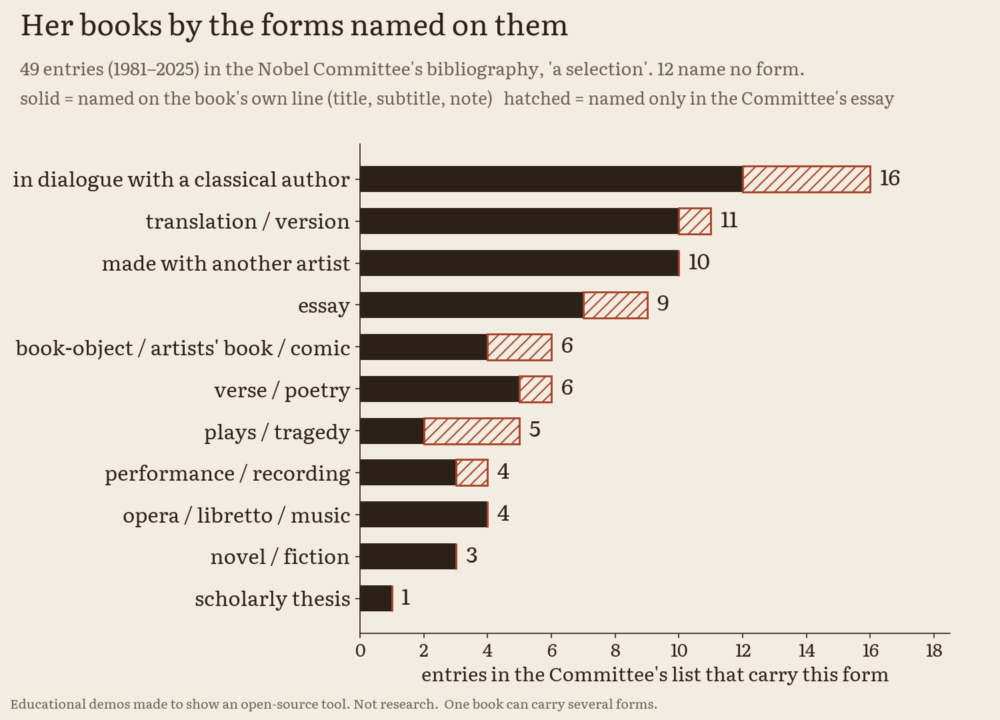
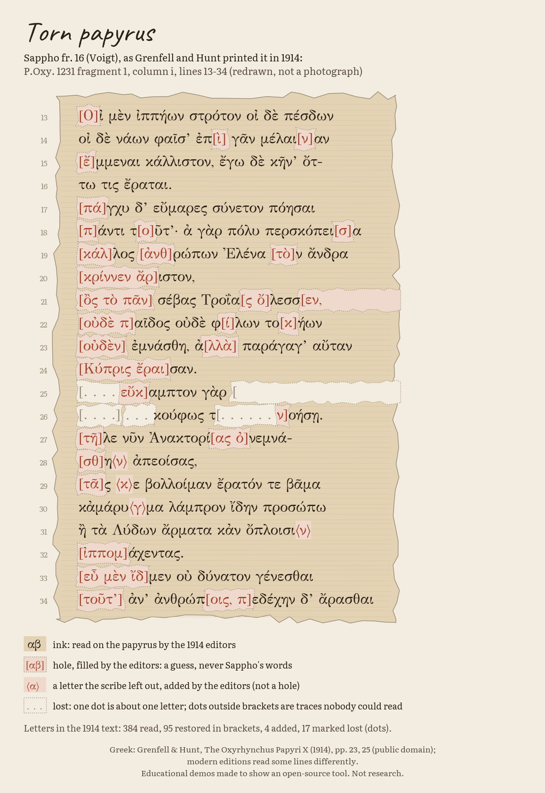
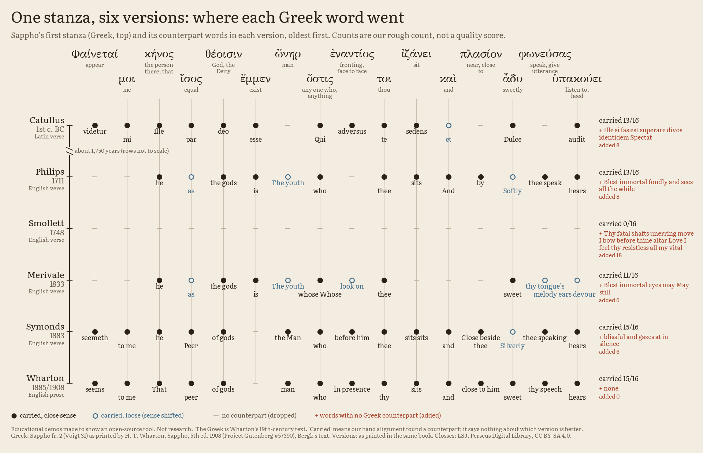

# Literature 2026: what survives, and what is new

> **Educational demos made to show an open-source tool. Not research.**

**Status:** facts: done · claims ledger: done (72 claims in use and 1 withdrawn row, 3 short quotations for the page and 2 more for the film, checked 2026-10-08) · the survival ledger: done · the forms shelf and the prize's history: done · fragments: done · translators: done · page: done · independent review: done, findings fixed · video: done

The 2026 Nobel Prize in Literature went to the Canadian author Anne Carson "for her bold and inventive oeuvre that, in playful dialogue with the classical tradition, has created new forms for contemporary literature". (L01) She is a classicist: her 1981 doctoral thesis was in Classics. (L05) She translates from Classical Greek, and the Nobel Committee calls her translations "independent works in their own right". (L07) Back to the [front page](../../README.md).

Numbers like (L01) point to rows in [CLAIMS.md](CLAIMS.md), where each sentence has its source.

**She is a living author, so this folder reproduces no passage of her work.** Facts about her books (titles, subtitles, years, and what the Committee says they are) are used; titles are facts. Her own words appear only as a few short quotations, each at most 15 words, attributed and set next to what they comment on, with the pages that confirm the wording (L59, L60, L62; the film shows two more, L64 and L65), and the line the Committee itself quotes, once per artefact (L09, L63). There is no likeness of her, no cover art and no imitation of her writing anywhere here (L46). Every Greek, Latin or English line we show is in the public domain, with its source.

## The story in four steps

The steps follow the citation's own words: the classical tradition, the dialogue with it, and the new forms.

1. **The classical tradition is mostly lost.** Of Sophocles' plays, more than 120 by modern estimate, seven survive complete. (L27) Of Aeschylus' 70 to 90, seven survive, one of them of disputed authorship; of Euripides' about 90, 18 or 19. (L28, L29) Sappho wrote an estimated 9,000 to 10,000 lines; about 650 survive. (L32) Book I of Sappho alone held 1,320 verses: the number is written on the papyrus roll's own end-title. (L33) Ancient counts come from sources such as the Suda, a 10th-century Byzantine encyclopedia, so we show them as testimony, next to modern estimates, as ranges. (L39, L40)
2. **What survives comes in pieces.** Only one poem of Sappho, fragment 1 (the Ode to Aphrodite), is certainly complete. (L35) The rest is mostly scraps: in Wharton's 1908 edition the median fragment has 7 Greek words, and about a third have 5 words or fewer, saved because a grammarian, a metrician or a dictionary quoted a word form or a metre. (L51, L53) Her poem 31 survives because a Greek critic quoted it in *On the Sublime*, and his quotation stops after the first line of a fifth stanza. (L49) On a papyrus roll found in Egypt, square brackets mark the places where the papyrus is torn and its letters are lost. (L47) Of the brackets that mark such holes she writes, introducing her translation of Sappho's fragments: "brackets imply a free space of imaginal adventure" (Anne Carson, *If Not, Winter*, 2002). (L60) In the 1914 edition of that roll, about one printed letter in five is the editors' restoration, a guess printed inside brackets. (L48) The Greek poet Stesichoros, whose fragments about the monster Geryon are the starting point of *Autobiography of Red* (1998), left 26 books by the Suda's count; only fragments survive. (L12, L30) Nearly all of Catullus reached us through one manuscript, known at Verona around 1300 and lost before 1400. (L36)
3. **The dialogue.** Her books pair ancient and modern writers: Simonides of Keos with Paul Celan, Thucydides with Virginia Woolf. (L10) *Nox* (2010) is, in the Committee's words, "an epitaph in the form of a box containing an accordion-fold-out of pictures, letters and other written texts", with Catullus' elegy 101 inside it. (L14) Of how it came to be a book she writes, about the person it remembers: "I made an epitaph for him in the form of a book." (Anne Carson, *Nox*, 2010). (L62) Translators have kept that dialogue going for two thousand years. Of six public-domain versions of Sappho 31, from Catullus' Latin to Wharton's English prose of 1885, three keep her opening "seems to me" and two open instead "Blest as the immortal gods is he". (L55, L56) Sappho calls Eros γλυκύπικρον, "sweet-bitter"; the 19th-century English versions say "bitter-sweet". (L58) Her first book begins there: "It was Sappho who first called eros 'bittersweet.'" (Anne Carson, *Eros the Bittersweet*, 1986). (L59)
4. **New forms.** Many of her subtitles name a form, or a mix: "A Novel in Verse", "A Fictional Essay in 29 Tangos", "Poetry, Essays, Opera". (L24) *Float* (2016) is twenty-two chapbooks that can be read in any order: 22! = 1,124,000,727,777,607,680,000 possible orders. (L15, L25) She is the 19th woman to receive the Nobel Prize in Literature, and the second Canadian, after Alice Munro (2013). (L18, L19)

## The stations

Six stops, as in a museum. Each says what it is made of and whether it is ready.

<table>
  <tr>
    <td width="96" valign="top"></td>
    <td valign="top"><b>1. The survival ledger</b> <i>(ready)</i><br>
    How much survives of the ancient authors the Committee names: Sappho, Sophocles, Euripides, Aeschylus, Stesichoros, Simonides, Thucydides and Catullus. Ancient testimony and modern estimates side by side, as ranges, with 54 sources, each with its quoted words (we paraphrase NC-licensed sources: the Suda and one encyclopedia article). An ink bookshelf (survivors inked, losses in pencil) and Sappho as 10,000 dots, about 650 inked, labelled "estimate". Folder: <a href="survival-ledger/README.md">survival-ledger</a>.</td>
  </tr>
  <tr>
    <td width="96" valign="top"></td>
    <td valign="top"><b>2. Where the words went</b> <i>(ready)</i><br>
    Three ways a Sappho poem is lost: a torn papyrus (P.Oxy. 1231, where 95 of 483 printed letters are the 1914 editors' restorations), a quotation that stops (Sappho 31 in <i>On the Sublime</i>, cut after the first line of a fifth stanza), and fragments of a few words (median 7 Greek words; 45 of 126 have 5 or fewer). Public-domain Greek from Wharton (1908) and Grenfell and Hunt (1914), with the editors' brackets shown as what they are. Folder: <a href="fragments/README.md">fragments</a>.</td>
  </tr>
  <tr>
    <td width="96" valign="top"></td>
    <td valign="top"><b>3. One poem, 2,000 years of translators</b> <i>(ready)</i><br>
    Sappho 31 and six public-domain versions (Catullus, 1st century BC; Philips 1711; Smollett 1748; Merivale 1833; Symonds 1883; Wharton's prose 1885), word by word: what each kept, dropped or added, in a hand alignment made in two passes. Our rough count, not a quality score. And one word, γλυκύπικρον, "sweet-bitter". Folder: <a href="translators/README.md">translators</a>.</td>
  </tr>
  <tr>
    <td width="96" valign="top"></td>
    <td valign="top"><b>4. The forms shelf</b> <i>(ready)</i><br>
    The 49 entries of the Committee's bibliography ("a selection") by the forms their own lines or the Committee name, each tag resting on a quoted subtitle or Committee phrase. <i>Float</i>'s 22 chapbooks and their 22! orders. And the prize's own history from the Nobel API: 123 laureates, 19 women, by decade, and who counts as Canadian depending on the field. Folder: <a href="forms/README.md">forms</a>.</td>
  </tr>
  <tr>
    <td width="96" valign="top"></td>
    <td valign="top"><b>5. The interactive page</b> <i>(ready)</i><br>
    Guess first, then see: the shelves of lost plays, the torn papyrus with a slider for the editors' restorations, the threads of one Greek stanza through six versions, and the forms shelf. One file, no network, light and dark. <a href="https://faviovazquez.github.io/nobel-2026-lab/2026/literature/page/">Try it online</a>. Folder: <a href="page/README.md">page</a>.</td>
  </tr>
  <tr>
    <td width="96" valign="top"></td>
    <td valign="top"><b>6. The video</b> <i>(ready)</i><br>
    A 2:29 explainer drawn in ink that tells the story, from the citation to the classical tradition in pieces, a torn papyrus, one Sappho poem through its translators and her new forms, one drawing per book; it asks no questions. <a href="video/exports/nobel-2026-literature.mp4">Watch the MP4</a>. Every fact in it comes from the <a href="CLAIMS.md">claims ledger</a>. Made with <a href="https://github.com/FavioVazquez/showtime">showtime</a>. Folder: <a href="video/README.md">video</a>.</td>
  </tr>
</table>

## The pictures

<p align="center">
  <picture>
    <source media="(prefers-color-scheme: dark)" srcset="survival-ledger/results/bookshelf_dark.png">
    
  </picture>
</p>

<p align="center">
  <picture>
    <source media="(prefers-color-scheme: dark)" srcset="survival-ledger/results/sappho_grid_dark.png">
    
  </picture>
</p>

<p align="center">
  <picture>
    <source media="(prefers-color-scheme: dark)" srcset="forms/results/forms_count_dark.png">
    
  </picture>
</p>

<p align="center">
  <picture>
    <source media="(prefers-color-scheme: dark)" srcset="fragments/results/papyrus_dark.png">
    
  </picture>
</p>

<p align="center">
  <picture>
    <source media="(prefers-color-scheme: dark)" srcset="translators/results/threads_stanza1_dark.png">
    
  </picture>
</p>

## What is real, and what is ours

<table>
  <tr>
    <th width="50%">Real</th>
    <th width="50%">Ours</th>
  </tr>
  <tr>
    <td valign="top">The prize, the date, the citation and the Committee's words about her books. Every sentence is sourced in <a href="FACTS.md">FACTS.md</a> and checked in <a href="CLAIMS.md">CLAIMS.md</a>.</td>
    <td valign="top">The form tags on her books: our labels, each resting on a quoted subtitle or Committee phrase, counted over the Committee's selection, not her whole output.</td>
  </tr>
  <tr>
    <td valign="top">The ancient testimony and modern estimates of what each ancient author wrote and what survives, each with its sources and their exact words.</td>
    <td valign="top">The drawings: one mark per play or book, a grid of 10,000 dots. They show estimates; the dot positions mean nothing.</td>
  </tr>
  <tr>
    <td valign="top">The prize's history: counts from the Nobel Prize API (CC0).</td>
    <td valign="top">22! orders of <i>Float</i>: arithmetic on the Committee's sentence, nothing about how the book is read.</td>
  </tr>
  <tr>
    <td valign="top">The Greek of Sappho as Wharton (1908) and Grenfell and Hunt (1914) printed it, with their brackets, and the six versions of poem 31 as Wharton printed them: public domain, byte for byte, each with its page.</td>
    <td valign="top">The counts: letters restored, words per fragment, who quoted what (our grouping), and the word-by-word alignment of the versions, a hand alignment in two passes. Our rough count, not a quality score; the drawings of the papyrus are redrawn, not photographs.</td>
  </tr>
</table>

## Folder map

| Path | What it is | Status |
|---|---|---|
| [FACTS.md](FACTS.md) | The sourced fact sheet: citation, laureate, what the Committee says about her books, the one quoted line, what survives of the classics, and what not to say | done |
| [CLAIMS.md](CLAIMS.md) | The ledger of claims we use, with sources and check dates (72 claims in use and 1 withdrawn row, 3 short quotations for the page and 2 more for the film), and the Committee quote rule | done |
| [survival-ledger](survival-ledger/README.md) | How much survives of the ancient authors the Committee names | done |
| [fragments](fragments/README.md) | Three ways a Sappho poem is lost | done |
| [translators](translators/README.md) | One poem, 2,000 years of translators | done |
| [forms](forms/README.md) | The forms shelf, 22 chapbooks, and the prize's history | done |
| [page](page/README.md) | Guess first, then see ([online](https://faviovazquez.github.io/nobel-2026-lab/2026/literature/page/)) | done |
| [video](video/README.md) | A 2:29 explainer that tells the story ([the MP4](video/exports/nobel-2026-literature.mp4)), its poster and captions, and which claims it uses | done |

## Rerun and check

Everything runs on an ordinary laptop processor in seconds, with no GPU and no accounts. Each folder's README has its exact steps. From each folder:

- **The survival ledger**, from `2026/literature/survival-ledger/` ([steps](survival-ledger/README.md)):

  ```bash
  python3.11 -m venv .venv && . .venv/bin/activate && pip install -r requirements.txt && python -m ledger.run_all
  ```

- **The forms shelf**, from `2026/literature/forms/` ([steps](forms/README.md)):

  ```bash
  python3.11 -m venv .venv && . .venv/bin/activate && pip install -r requirements.txt && python -m shelf.run_all
  ```

- **Where the words went**, from `2026/literature/fragments/` ([steps](fragments/README.md)):

  ```bash
  python3.11 -m venv .venv && . .venv/bin/activate && pip install -r requirements.txt && python -m sapphofrag.run_all
  ```

- **The translators**, from `2026/literature/translators/` ([steps](translators/README.md)):

  ```bash
  python3.11 -m venv .venv && . .venv/bin/activate && pip install -r requirements.txt && python -m translators.run_all
  ```

- **The page** needs nothing: open `2026/literature/page/index.html` in a browser. `python3 build_data.py` in `page/` rebuilds its data from the four experiments ([steps](page/README.md)).
- Tests: `python -m pytest -q tests` in each folder. `python -m ledger.check_sources` re-fetches every quoted source of the survival ledger (network).

These are teaching demos. The counts are of sources and estimates, and the figures are drawings of them. They are not research and not literary criticism.

## Glossary

| Term | In plain English |
|---|---|
| Fragment | A piece of an ancient text that survives without the rest: a scrap of papyrus, or a few lines quoted by a later writer. |
| Papyrus | A writing sheet made from the papyrus plant. Many lost Greek texts were found on papyrus scraps in Egypt, at Oxyrhynchus. |
| The Suda | A Greek encyclopedia compiled in the Byzantine empire in the 10th century AD. Its counts of ancient works are testimony, not measurements. |
| Testimony | What an ancient source says about an author. Often centuries later, sometimes contradictory. |
| End-title | The title written at the end of an ancient book roll; Sappho's Book I gives the number of its verses there. |
| Chapbook | A small, thin booklet. |
| 22! ("22 factorial") | 22 × 21 × 20 × ... × 2 × 1: the number of ways to put 22 different things in a row. |
| Satyr play | A short comic play that followed three tragedies at the Athenian festival. |
