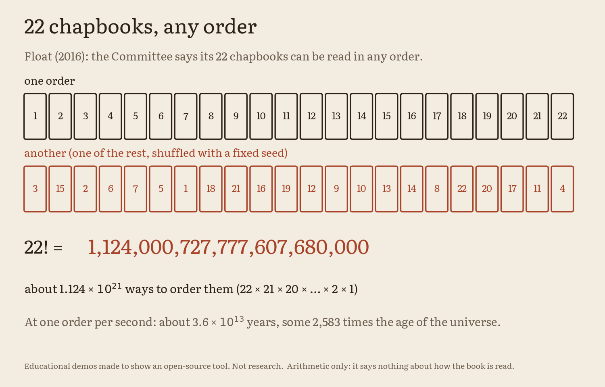
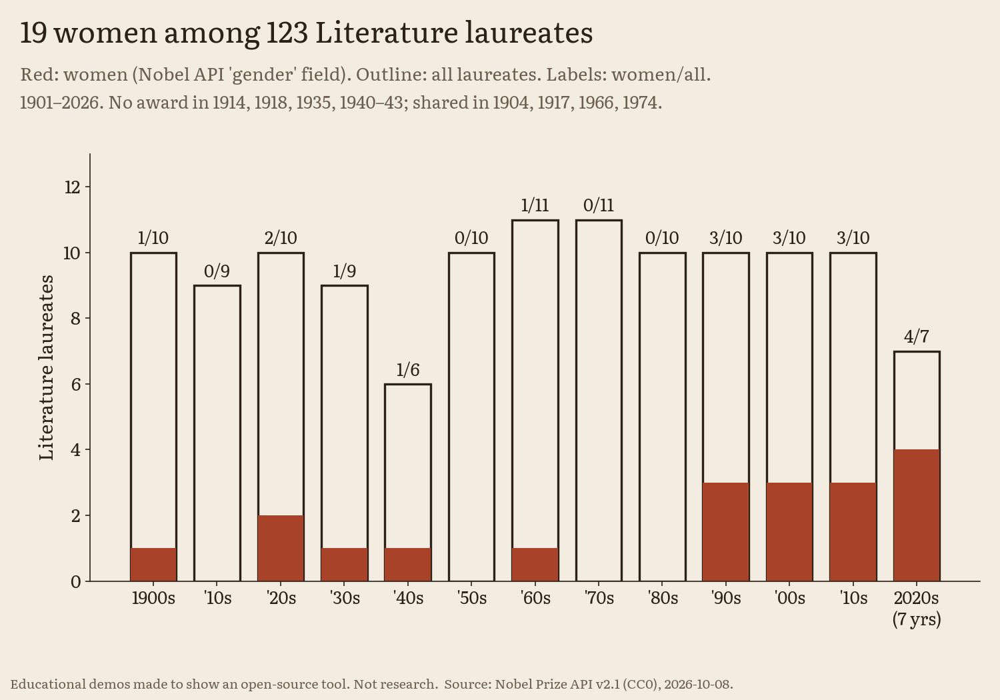

# The forms shelf, 22 chapbooks, and the prize's own history (Literature 2026)

> **Educational demos made to show an open-source tool. Not research.**
> Counts of a list, not literary criticism. Every tag rests on a quoted subtitle or a quoted phrase of the Nobel
> Committee; none is our own reading of a book.

The 2026 Nobel Prize in Literature went to Anne Carson "for her bold and inventive oeuvre that, in playful dialogue
with the classical tradition, has created new forms for contemporary literature". This folder asks three plain
questions with facts only:

1. **Which forms do her books name?** Many of her subtitles name a form, or mix of forms. We tag each entry of the
   Nobel Committee's own bibliography by the forms its line (title, subtitle, note) or the Committee's essay names.
2. **How many ways can 22 chapbooks be ordered?** The Committee says *Float* (2016) consists of "twenty-two chapbooks on
   different subjects, capable of being read in any order". That is 22! orders.
3. **Where does she sit in the prize's history?** From the Nobel Prize API (CC0): 123 Literature laureates, 19 women,
   by decade; and who counts as Canadian, depending on which field you read.

None of her text is used here. The only things taken from her books are titles and subtitles, as printed in the
Committee's list (titles are facts). No cover art, no likeness.

Own code, MIT licence. CPU only. Python 3.11 with Matplotlib.

## Run it

From `2026/literature/forms/`:

```bash
python3.11 -m venv .venv && . .venv/bin/activate && pip install -r requirements.txt
python -m shelf.run_all        # results/forms.json, results/prize_history.json and 10 figures, about 10 seconds
python -m pytest -q tests      # 11 tests, under a second (1 skipped unless LIT_BIO_HTML is set, see below)
python -m shelf.fetch_api      # optional: refresh the Nobel API snapshot (network); the build reads the committed one
```

The optional test checks every Committee phrase and every bibliography line byte for byte against a saved copy of the
page: save <https://www.nobelprize.org/prizes/literature/2026/bio-bibliography/> as HTML and run
`LIT_BIO_HTML=/path/to/page.html python -m pytest -q tests`. We do not commit the page (its text is © Nobel Prize
Outreach); we keep only the bibliographic records, which are facts.

## 1. The forms shelf (a selection)

Source: the Nobel Committee's bio-bibliography (signed Anders Olsson, Chair of the Nobel Committee),
<https://www.nobelprize.org/prizes/literature/2026/bio-bibliography/>, accessed 2026-10-08. Its list is headed
**"Bibliography – a selection"**, so every count below is a count of that selection, not of everything she has written.
We keep its 33 "Works in English" entries and its 16 "Other" entries (49 in all, 1981-2025), exactly as printed, in
[`data/committee_bibliography.json`](data/committee_bibliography.json). The translations into Swedish, French and
German and the further reading are not used.

**How a tag is given.** Each of the 49 entries is one row in [`shelf/works.py`](shelf/works.py). A tag needs a quoted
string, stored next to it:

* **line**: the string is part of that entry's own bibliography line, for example *Autobiography of Red: A Novel in
  Verse* gives "novel / fiction" and "verse" from "A Novel in Verse"; *Decreation: Poetry, Essays, Opera* gives verse,
  essay and opera. A test checks every such string against the stored line.
* **committee**: the string is a phrase of the Committee's essay on the same page, for example *Nox* (2010) is "a box
  containing an accordion-fold-out", and *Float* is "twenty-two chapbooks on different subjects, capable of being read
  in any order". A test checks these byte for byte against a saved copy of the page.

Where neither names a form we give no tag (12 entries, for example *Short Talks*, *Red Doc>*, *The Albertine Workout*).
We do not read a form into a title word such as "playbook".

| form (our label) | entries | of which named only in the Committee's essay |
|---|---|---|
| in dialogue with a classical author | 16 | 4 |
| translation / version | 11 | 1 |
| made with another artist | 10 | 0 |
| essay | 9 | 2 |
| verse / poetry | 6 | 1 |
| book-object / artists' book / comic | 6 | 2 |
| plays / tragedy | 5 | 3 |
| performance / recording | 4 | 1 |
| opera / libretto / music | 4 | 0 |
| novel / fiction | 3 | 0 |
| scholarly thesis | 1 | 0 |

One entry can carry several forms. `results/forms.json` lists every entry with its line, its tags and the evidence for
each tag, and a summary (entries with two or more forms, tags per basis, and so on).

<p align="center">
  <picture>
    <source media="(prefers-color-scheme: dark)" srcset="results/forms_count_dark.png">
    
  </picture>
</p>

`forms_matrix_{light,dark}` shows the same tags entry by entry along the years (ink squares: named on the line; red
rings: named only in the Committee's essay).

**Simplifications.** Our tag labels group words (a "libretto" and a text "for Narrator and Orchestra" both count as
"opera / libretto / music"). "In dialogue with a classical author" means the line or the Committee names a Greek or
Latin author for that book (Sappho, Stesichoros, Simonides, Thucydides, Catullus, Sophocles, Euripides, Aeschylus); it
is not our judgement of how classical a book is. Reissues and shared volumes are separate entries because the
Committee lists them separately.

## 2. 22 chapbooks, 22! orders

22! = 22 × 21 × ... × 2 × 1 = **1,124,000,727,777,607,680,000** (22 digits, about 1.124 × 10²¹). It is the number of
ways to put 22 different things in a row. A test checks the integer exactly. In `forms.json` it is stored as a string,
because a JavaScript number cannot hold it exactly.

For scale (pure arithmetic): reading one order per second would take about 3.6 × 10¹³ years, some 2,583 times the age
of the universe (13.787 billion years, Planck Collaboration 2018, results VI, arXiv:1807.06209).

What it does not say: anything about how the book is meant to be read beyond the Committee's "any order", or about
what the chapbooks contain.

<p align="center">
  <picture>
    <source media="(prefers-color-scheme: dark)" srcset="results/float_22_dark.png">
    
  </picture>
</p>

## 3. The prize's own history (Nobel API, CC0)

Source: Nobel Prize API v2.1, `laureates?nobelPrizeCategory=lit&limit=300` and
`nobelPrizes?nobelPrizeCategory=lit&limit=200`, fetched 2026-10-08, "free to use according to the Creative Commons
Zero (CC0) license" ([terms](https://www.nobelprize.org/about/terms-of-use-for-api-nobelprize-org-and-data-nobelprize-org/)).
A trimmed snapshot (only the fields we use, under their API paths) is in
[`data/nobel_api_lit_2026-10-08.json`](data/nobel_api_lit_2026-10-08.json).

| what | value | how |
|---|---|---|
| award years 1901-2026 | 126 | `nobelPrizes` count |
| years with no award | 7: 1914, 1918, 1935, 1940, 1941, 1942, 1943 | award years with no laureate |
| years awarded | 119 | 126 − 7 |
| shared prizes | 4: 1904, 1917, 1966, 1974 | award years with two laureates |
| laureates | 123 | `laureates` count (= 119 + 4) |
| women | 19 (men 104) | API field `gender`; cross-check: nobelprize.org's [list of women laureates](https://www.nobelprize.org/prizes/lists/nobel-prize-awarded-women/) |
| Anne Carson | the 19th woman, laureate id 1067 | women sorted by award year |
| women by decade | 1900s 1/10, 1910s 0/9, 1920s 2/10, 1930s 1/9, 1940s 1/6, 1950s 0/10, 1960s 1/11, 1970s 0/11, 1980s 0/10, 1990s 3/10, 2000s 3/10, 2010s 3/10, 2020s (2020-2026, 7 years) 4/7 | women / all laureates per decade |

**Canadians: say which field.** The API has no citizenship field.

* **By place of birth** (`birth.place.country.en` and `birth.place.countryNow.en` = "Canada"): **3**, Saul Bellow
  (1976), Alice Munro (2013), Anne Carson (2026).
* **By the Academy's wording** ("awarded to the Canadian author ..." in the press release): **2**, Alice Munro
  ([2013](https://www.nobelprize.org/prizes/literature/2013/press-release/)) and Anne Carson
  ([2026](https://www.nobelprize.org/prizes/literature/2026/press-release/)); both phrases checked on the pages
  2026-10-08.
* Saul Bellow was born in Lachine, Quebec, and grew up in Chicago; the 1976 press release places him in "American
  narrative art" ([1976](https://www.nobelprize.org/prizes/literature/1976/press-release/)).
* So the safe sentence is: **Anne Carson is the second Canadian Literature laureate, after Alice Munro (2013).** Not
  "the third Canadian". The birth field would also miss a Canadian born abroad.

<p align="center">
  <picture>
    <source media="(prefers-color-scheme: dark)" srcset="results/prize_by_decade_dark.png">
    
  </picture>
</p>

`prize_timeline_{light,dark}` draws the 123 laureates as 123 small books along the years (women tall and red) and marks
the three born in Canada, with the field each one counts under.

**Simplifications.** Gender is as the API records it. Decades are calendar decades (the 1900s start in 1901, the 2020s
have 7 award years so far). No causal story and no prediction.

## Data for the video and the page

| file | contents |
|---|---|
| `results/forms.json` | `status`, the tag vocabulary, every entry (line, tags, evidence with basis), the summary, the 22! card (exact string, grouped, scientific, scale) |
| `results/prize_history.json` | totals, Carson's place, the 13 decades (laureates, women, names), the 19 women in order, the two Canadian fields |
| `results/*_{light,dark}.{png,svg}` | forms_count, forms_matrix, float_22, prize_by_decade, prize_timeline |

## Sources

| what | source |
|---|---|
| bibliography entries, Committee phrases, "a selection" | Nobel Committee for Literature, bio-bibliography, <https://www.nobelprize.org/prizes/literature/2026/bio-bibliography/> (accessed 2026-10-08) |
| citation | press release, <https://www.nobelprize.org/prizes/literature/2026/press-release/> |
| laureates, gender, birth country, award years | Nobel Prize API v2.1 (CC0), fetched 2026-10-08 |
| "Canadian author" wording | press releases 2013 and 2026; Bellow: 1976 press release |
| age of the universe (scale only) | Planck Collaboration, A&A 641, A6 (2020), arXiv:1807.06209 |

## What each file does

| file | in plain words |
|---|---|
| `shelf/works.py` | the 49 rows: short title, year, tags, and the quoted evidence for each tag |
| `shelf/analysis.py` | the counts, the 22! card and the prize history |
| `shelf/figures.py`, `shelf/style.py` | the figures, light and dark (fonts from `../survival-ledger/fonts/`, SIL OFL) |
| `shelf/fetch_api.py` | optional refresh of the Nobel API snapshot |
| `shelf/run_all.py` | one command for everything |
| `tests/test_shelf.py` | 22! exact; every tag has evidence on its line; Committee phrases byte for byte (optional); prize counts; the Canadian fields |

## Licence

Our code: MIT. The API snapshot is CC0 (Nobel Prize Outreach). The bibliography records are facts taken from the
Committee's page, kept so the tags can be checked.
