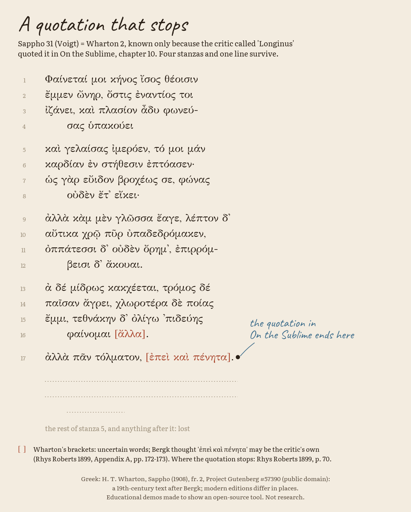
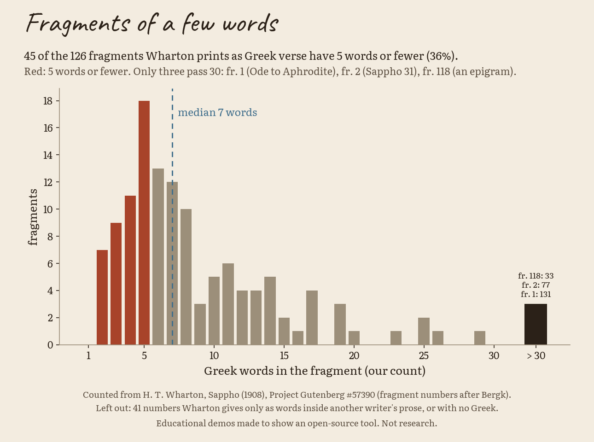
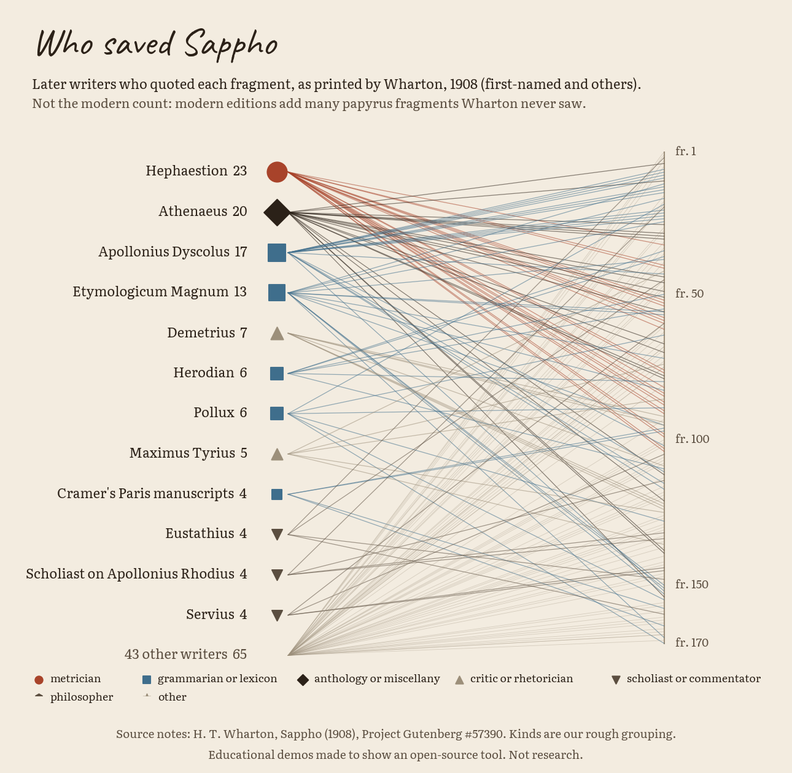

# Where the words went (Literature 2026, fragments)

> **Educational demos made to show an open-source tool. Not research.**
> Every Greek and English line here is public domain and is stored next to its source and page or fragment number.
> The Greek is what editors printed in 1908 and 1914; modern editions read many places differently.

The 2026 Nobel Prize in Literature citation speaks of "playful dialogue with the classical tradition". Much of that
tradition reaches us only in pieces. This folder shows, with real objects, three ways a poem by Sappho (Lesbos,
"flor. 600 B.C." in Rhys Roberts 1899, p. 240) was lost, and what editors do with the pieces:

1. **A torn papyrus.** A roll copied in the 2nd century AD was found at Oxyrhynchus in Egypt and published in 1914
   (P.Oxy. 1231). Holes in the papyrus took letters with them. The editors filled some holes with their own guesses,
   inside square brackets.
2. **A quotation that stops.** Sappho 31 survives only because a Greek critic (known as "Longinus") quoted it in
   *On the Sublime*. He quoted four stanzas and one line, then went back to his own argument. The rest is gone.
3. **Fragments of a few words.** Most of what survives is a line or a few words that a grammarian, a metrician or a
   dictionary quoted to show a word form or a metre.

Own code, MIT licence (the repo's). CPU only. Python 3.11 with Matplotlib; everything else is the standard library.

## Run it

From `2026/literature/fragments/`:

```bash
python3.11 -m venv .venv && . .venv/bin/activate && pip install -r requirements.txt
python -m sapphofrag.run_all        # results/fragments.json + 8 figures (PNG + SVG), about 5 seconds
python -m pytest -q tests           # 186 checks, under 1 second
```

`python -m sapphofrag.fetch_digitalsappho` re-derives the numbering table (it downloads about 100 pages at one per
second into `work/`, which is not committed). The build itself needs no network.

## What a fragment is, and how editors mark one

A **fragment** is any piece of an ancient text that survives without the rest: a scrap of papyrus, or a few lines
another ancient writer quoted. Sappho's poems were collected in nine books in antiquity, and the books are lost
(Wikipedia, "Sappho"). What we have comes from **quotations** in other writers (nearly all of what Wharton could
print in 1908) and from **papyri** found in Egypt since the late 19th century (the 1914 papyrus below is one).

Editors mark what they did with signs. Grenfell and Hunt (1914) use these; they mean the same in the Leiden
conventions agreed later, in 1931-2:

| sign | meaning | in our data |
|---|---|---|
| `[αβγ]` | letters lost where the papyrus is gone; the letters inside are the **editors' restoration** | `restored` |
| `[. . .]` | letters lost and not restored; one dot is about one letter | `lost` |
| `. . .` outside brackets | traces of ink the editors could not read | `lost` (mark: traces) |
| `⟨α⟩` | a letter the scribe left out, added by the editors | `restored` (mark: `⟨⟩`) |
| `[` at the end of a line | the loss runs on to the end of the line | `lost` or `restored` (mark: open to line end) |

**A restoration is an editor's guess. It is never Sappho's words.** The figure draws restorations in a second, pale
hand inside the holes so the two never look alike.

Wharton (1908) uses square brackets differently: for words in the quoted text that he thinks are uncertain or not
Sappho's.

## The answers

### (a) The torn papyrus: P.Oxy. 1231 fr. 1 col. i 13-34 (Sappho 16 Voigt)

22 lines, typed by hand from the 1914 page images, then checked again character by character against crops zoomed
2 to 6 times (`sources/poxy1231_fr1_col1_13-34.tsv`; pages 23 and 25, scan leaves 47 and 49). Grenfell and Hunt's
literal English is on page 40 (leaf 64), stored in `sources/poxy1231_translation_1914.txt`; its own square brackets
mark a sentence that renders a conjecture for lines 25-6.

| in the 1914 text | letters |
|---|---|
| read on the papyrus | 384 |
| restored by the editors inside `[ ]` | 95 |
| added by the editors inside `⟨ ⟩` (scribe's omissions) | 4 |
| marked lost with dots | 17 |

So about one letter in five of this printed poem (95 + 4 of 483 printed letters) is the editors', not the papyrus's.
Each line in `fragments.json` is a list of spans `{text, kind, mark}` whose texts join back into the printed line.

<p align="center">
  <picture>
    <source media="(prefers-color-scheme: dark)" srcset="results/papyrus_dark.png">
    
  </picture>
</p>

### (b) The quotation that stops: Sappho 31 (Voigt) = Wharton 2

Greek and literal English from Wharton (fragment 2, 17 printed lines). Where the quotation ends is checked in
W. Rhys Roberts, *Longinus On the Sublime* (Cambridge, 1899): on p. 70 the Greek prints lines 1-16 as four stanzas,
then line 17 "ἀλλὰ πᾶν τολματόν, ἐπεὶ καὶ πένητα" set apart, then section 3 begins in Longinus' own words
("οὐ θαυμάζεις ..."). So the quotation stops **after the first line of a fifth stanza**. Wharton prints
"[ἄλλα]" (line 16) and "[ἐπεὶ καὶ πένητα]" (line 17) in brackets; Roberts' Appendix A (pp. 172-173) reports that Bergk
bracketed "ἐπεὶ καὶ πένητα" because these words may be Longinus', not Sappho's, and that Crusius (1897) ends the ode
at "φαίνομαι ἄλλα". Roberts 1899 is not on Project Gutenberg; we used the archive.org scan
(`longinusonsubli00waygoog`). Project Gutenberg's *On the Sublime* is H. L. Havell's translation (#17957), not used.

<p align="center">
  <picture>
    <source media="(prefers-color-scheme: dark)" srcset="results/stopped_quotation_dark.png">
    
  </picture>
</p>

### (c) Fragments of a few words (Wharton 1908)

Wharton numbers 170 fragments (Bergk's numbers). Our parser reads every one from the Gutenberg HTML: the Greek
(`<span class="fsn">` inside the verse block, before the translation), his literal English (the first italic
paragraph after the Greek) and his notes.

* 129 numbers are printed as Greek verse; three pairs are printed as one entry (7-8, 107-108, 122-123), so
  **126 entries** are counted. 41 numbers (mostly in his "Miscellaneous" section, frs. 124-170) give Sappho only
  as single words inside another writer's sentence, or give no Greek at all: they are left out of the counts
  (a word quoted inside another writer's prose cannot be separated from his sentence without judgment).
* **Median: 7 Greek words. 45 of 126 entries (35.7%) have 5 words or fewer; 88 (69.8%) have 10 or fewer.**
  Only three pass 30 words: fr. 1, the Ode to Aphrodite (131), fr. 2 = Sappho 31 (77) and fr. 118, an epigram (33).
  The shortest have 2 words (frs. 47, 49, 61, 96, 115).
* Sensitivity: if the 29 numbers that Wharton gives only as words inside prose were counted as one word each,
  the median would be 6 and the share at 5 words or fewer 47.7% (155 entries). That is a bound, not a count.

**How we counted (the rule).** A word is a run of Greek letters with their accents. An elided word with its
apostrophe (δ') counts once. A word split over two printed lines with a hyphen counts once. Words in Wharton's
square brackets count (they are also given separately as `words_in_brackets`). Metrical signs, dots and Latin
letters do not count. Hand-checked: fr. 2 = 77 words (counted by hand line by line), fr. 1 = 131, fr. 118 = 33,
fr. 40 = 9, fr. 16 = 11, and the five 2-word entries; the tests hold these.

<p align="center">
  <picture>
    <source media="(prefers-color-scheme: dark)" srcset="results/fragment_lengths_dark.png">
    
  </picture>
</p>

### Who saved Sappho (panel; as printed by Wharton, 1908)

For each fragment, the writer(s) Wharton names as quoting it, typed into `sapphofrag/quoters.py` by a hand pass over
all 170 notes; each entry carries a short string copied from Wharton's note, and a test checks it is there. First
writers (named first or with others): Hephaestion (the metrician) 23 fragments, Athenaeus 20, Apollonius Dyscolus
(the grammarian) 17, the *Etymologicum Magnum* (a dictionary Wharton dates to about the 10th century) 13, then
Demetrius 7, Herodian 6, Pollux 6; 55 writers in all. By our rough
grouping of the first-named writer: grammarians and dictionaries 58, metricians 27, anthologies and miscellanies 27,
critics and rhetoricians 25, scholiasts and commentators 20, philosophers 6, others 5; Wharton names nobody for two
numbers (65; 141, which he moved to 57A). The reason each was quoted (`quote_reason`: metre, language, style, or
subject/unstated) is our keyword reading of his note, labelled as such.

<p align="center">
  <picture>
    <source media="(prefers-color-scheme: dark)" srcset="results/quoters_dark.png">
    
  </picture>
</p>

## Numbering: Wharton (Bergk) next to Voigt

Wharton follows Bergk's numbers; editions since 1955 use Lobel-Page, and Voigt (1971) keeps those numbers. Wharton 2
is Voigt 31; Wharton 1 is Voigt 1; the papyrus poem is Voigt 16, of which Wharton knew only two lines (his fr. 13).
`sources/concordance_wharton_voigt.csv` is our lookup table:

1. **Proposal**: for each of Wharton's verse fragments, the fragment on *The Digital Sappho*
   (<https://digitalsappho.org/>, which prints Greek under Voigt/Campbell numbers, CC BY-SA 4.0) that shares the most
   Greek words (marks removed, words of 3+ letters). Accepted automatically at 75% shared and at least 3 words
   (71 rows, each looked at once).
2. **Hand pass**: 36 rows checked by eye; 18 single words of Wharton's Miscellaneous matched to Voigt 170-191 by the
   alphabetical list on Digital Sappho's page for frs. 169-192, using its two explicit anchors (178, 185) and
   counting along: marked `probable`.
3. **Gaps**: 45 numbers stay empty (`?`): no match found, an epigram from the Greek Anthology, or a testimony
   without Greek. Only numbers come from that site, never text.

Count: 71 auto, 36 hand, 18 probable, 45 gaps (of 170).

## Every caveat

* **1914 and 1908 readings differ from modern editions.** Grenfell and Hunt printed their first reading of a
  new papyrus, and later editors changed several lines. The 1914 notes (p. 40) already call the reading of lines
  18-19 "very uncertain" and the reconstruction of 27-28 not "very satisfactory". Wharton prints a 19th-century text after Bergk,
  with Aeolic forms of his time. We show what those editions printed, not what Sappho wrote.
* **Restorations are editors' guesses, never Sappho's words.** Wilamowitz proposed several of them (G&H, p. 40).
* **Gutenberg's transcription is not the book.** We compare against Project Gutenberg's HTML (eBook #57390, our
  copy's SHA-256 is in `fragments.json`); it may differ from the printed 1908 page in accents in a few places
  (for example "λυσιμελης" without an accent in fr. 40). We keep it exactly as Gutenberg has it.
* **Our transcription of the papyrus has its own conventions**: Unicode NFC, U+2019 for the elision mark, U+00B7
  for the raised stop, ⟨ ⟩ as U+27E8/U+27E9, the 1914 dots kept as printed. The `ῃ` at the end of line 26 has a
  mark under it in the 1914 print that we read as the iota subscript; the second "οὐδὲ" in line 22 has a speck under
  it that we read as a print blemish, not a dot under the letter. Both are listed for the reviewer.
* **A "fragment" here is Wharton's unit.** His 170 numbers mix poems, lines, single words and testimonies; modern
  editions count differently and add many papyrus fragments he never saw. The statistics describe his book, not
  Sappho's surviving work today.
* **Who quoted what is as printed by Wharton, 1908.** Several attributions are disputed. "Kind" and "reason" are
  our rough grouping of his notes.
* **The concordance is partial** (45 gaps) and partly automatic; `probable` rows rest on the order of a list.
* Sappho's whole output and the share lost are estimates only (Grenfell and Hunt, p. 20, from the roll's title tag:
  Book I held 1,320 verses, and "something like 9,000 verses" in all). We give no "percentage of Sappho lost".

## Sources and licences

| what | source | licence |
|---|---|---|
| P.Oxy. 1231 Greek and English | B. P. Grenfell and A. S. Hunt, *The Oxyrhynchus Papyri* X (London, 1914), pp. 20-25, 40; scan <https://archive.org/details/oxyrhynchuspapyr10gren> | public domain (Grenfell d. 1926, Hunt d. 1934); our transcription CC0 |
| Wharton's Greek, English and notes | H. T. Wharton, *Sappho*, 5th ed. (John Lane, 1908), Project Gutenberg #57390, HTML: <https://www.gutenberg.org/cache/epub/57390/pg57390-images.html> (copy in `sources/`, Gutenberg licence kept inside) | public domain |
| where the Longinus quotation ends | W. Rhys Roberts, *Longinus On the Sublime* (Cambridge, 1899), pp. 70-71, 172-173, 240; <https://archive.org/details/longinusonsubli00waygoog> | public domain |
| Voigt numbers (numbers only) | *The Digital Sappho*, <https://digitalsappho.org/> | CC BY-SA 4.0 (credited; we copy no text) |
| fonts | GFS Didot, EB Garamond, Literata, Caveat (`fonts/`, each with its OFL.txt) | SIL Open Font License 1.1 |

## Files

| file | what |
|---|---|
| `results/fragments.json` | `papyrus` (lines with spans and page/line anchors, 1914 English), `sappho31` (lines, stanzas, cut point with evidence), `wharton_fragments` (170 rows: `wharton_no`, `voigt_no`, `greek`, `english_literal`, `source_author`, `words`, anchors), `stats`, `quoters_network` |
| `results/*_{light,dark}.{png,svg}` | the four figures |
| `sources/` | the stored source texts and the concordance |
| `sapphofrag/` | parser, spans, counts, concordance, figures; `run_all.py` runs everything |
| `tests/test_fragments.py` | byte-for-byte string checks, span reassembly, counts, hand counts, concordance |
