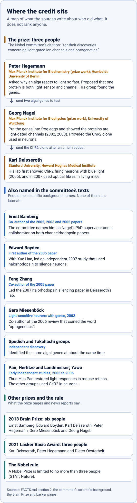

# Medicine 2026: a light switch for nerve cells

> **Educational demos made to show an open-source tool. Not research, and not for any lab or clinical use.**

**Status:** facts: done · claims ledger: done (27 claims, checked 2026-10-06) · pictures: done · simulator: done, independently reviewed · heat budget: done · interactive page: done · video: done

The 2026 Nobel Prize in Physiology or Medicine went to Karl Deisseroth, Peter Hegemann and Georg Nagel for optogenetics. Back to the [front page](../../README.md).

## The story in 14 lines

Numbers like (C05) point to rows in [CLAIMS.md](CLAIMS.md), where each sentence has its source.

1. A green alga, Chlamydomonas, is about 0.015 millimetres across, and it swims toward light. The Nobel Committee says it reacts to light more than twenty times faster than a human eye. (C03, C04)
2. In the early 1990s Peter Hegemann proposed that a single protein could both catch light and act as an ion channel. The idea met scepticism. (C05)
3. In 1999 Francis Crick wrote that the ideal signal for switching neurons on and off would be light, though he called the idea "rather far-fetched". (C15)
4. To test two algal genes, Georg Nagel injected them into frog eggs. The eggs built the proteins, and when light hit them the channels opened. (C06)
5. In 2002 Nagel, Hegemann, Bamberg and colleagues reported channelrhodopsin-1, a light-gated channel that lets protons through. In 2003 they showed that channelrhodopsin-2 is opened directly by light and works in mammalian cells too. (C07, C08)
6. The 2003 paper predicted that channelrhodopsin-2 should become a useful tool for controlling a cell's membrane potential. It responds to blue light. (C09, C10)
7. Around 1 a.m. on 4 August 2004, Edward Boyden saw the first neuron carrying the protein fire to blue light. In 2005 Boyden, Zhang, Bamberg, Nagel and Deisseroth reported millisecond control of mammalian nerve cells. (C11, C12)
8. Neurons did not need any added retinal, the light-catching molecule, because the trace amounts they already contain were enough. (C13)
9. The Nobel Committee says that in 2007 Deisseroth's lab made the switch work in the brains of living mice, using a thin optical fibre to deliver the light. (C14)
10. The word "optogenetics" was coined in a 2006 review. In 2010 Nature Methods chose optogenetics as its Method of the Year. (C16, C17)
11. There are limits. Visible light cannot penetrate deep inside brain tissue, and fibre interfaces have to deliver about 100 times more light at the tip than the cells need, because the brain scatters it. (C20, C21)
12. Light also warms tissue. One study found that common light protocols raised brain temperature by 0.2 to 2 degrees Celsius and suppressed firing, and another saw firing rise even in cells with no light-sensitive protein. This is what the simulator's heat station is about. (C22, C23)
13. In medicine, doctors reported partial recovery of sight in one blind patient in 2021. An optogenetic gene therapy for retinitis pigmentosa was accepted for FDA review on 9 September 2026 and is not approved. (C24, C25)
14. On 5 October 2026 the Nobel Assembly awarded the prize to the three laureates. The credit map shows who else the sources name, and two earlier prizes that included different groups. (C01, C18, C19)

## The pictures

<p align="center">
  <picture>
    <source media="(prefers-color-scheme: dark)" srcset="../../assets/diagram-timeline-dark.svg">
    <source media="(prefers-color-scheme: light)" srcset="../../assets/diagram-timeline-light.svg">
    
  </picture>
</p>

<p align="center">
  <picture>
    <source media="(prefers-color-scheme: dark)" srcset="../../assets/diagram-light-gated-channel-dark.svg">
    <source media="(prefers-color-scheme: light)" srcset="../../assets/diagram-light-gated-channel-light.svg">
    
  </picture>
</p>

<p align="center">
  <picture>
    <source media="(prefers-color-scheme: dark)" srcset="../../assets/diagram-credit-map-dark.svg">
    <source media="(prefers-color-scheme: light)" srcset="../../assets/diagram-credit-map-light.svg">
    
  </picture>
</p>

## Folder map

| Path | What it is | Status |
|---|---|---|
| [FACTS.md](FACTS.md) | The sourced fact sheet: citation, laureates, credit notes, timeline, how the channel works, limits | done |
| [CLAIMS.md](CLAIMS.md) | The ledger of 27 claims we use, with sources and check dates | done |
| [`../../assets`](../../assets/diagram-timeline-light.svg) | The timeline, the four-step channel drawing and the credit map, in dark and light | done |
| [simulator](simulator/README.md) | Toy models: light spreading through tissue at three colours, the heat it adds, a four-state light-gated channel and a simple nerve cell (Python, CPU only) | done, reviewed by a second agent |
| [heat-budget](heat-budget/README.md) | How many neurons can one degree of warming buy you? Built on the simulator | done |
| `results/` | Figures and tables written by the simulator | done |
| `tests/` | Automatic checks for the simulator | done |
| [video](video/README.md) | A 2:21 explainer, a version that stops and asks ([play it online](https://faviovazquez.github.io/nobel-2026-lab/2026/medicine/video/interactive/)), the plan, the source and the critics' reports | done |
| [page](page/README.md) | A page for playing with the numbers in a browser: guess first, then see ([online](https://faviovazquez.github.io/nobel-2026-lab/2026/medicine/page/), or open `page/index.html`) | done |

## Rerun and check

The facts and pictures need no code. To rebuild the pictures: `python3 tools/make_diagrams.py`. To check every link, image and source in this repository without a network: `python3 tools/check_links.py`.

To rerun the simulator, from this folder (the [simulator README](simulator/README.md) is the reference if it differs):

```bash
python3.11 -m venv .venv && . .venv/bin/activate && pip install -r simulator/requirements.txt && python -m simulator.run_all
```

These are teaching toys. The simulator is a simplified model and its outputs are for learning only. They are not for planning an experiment, a device or a treatment.
