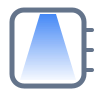
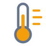
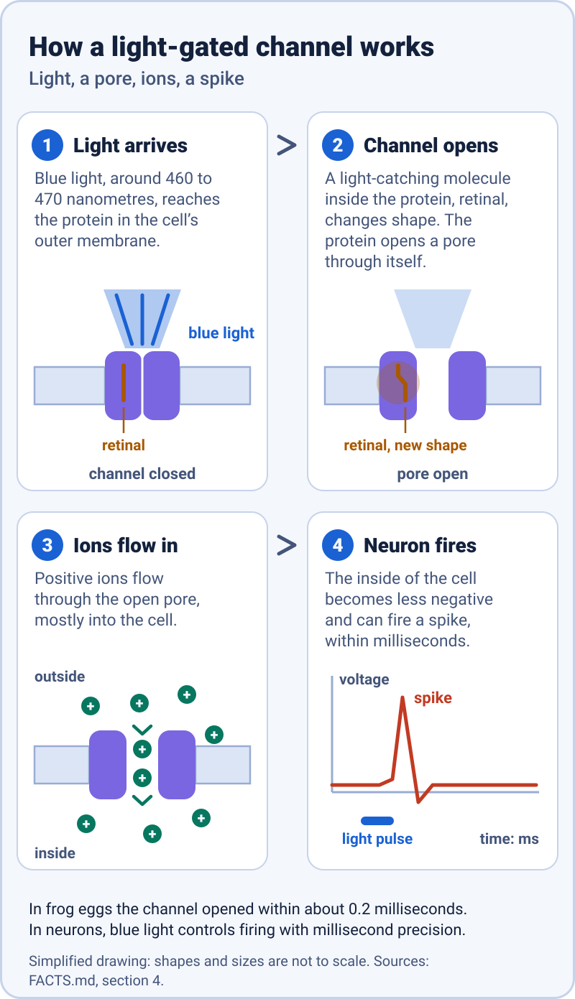
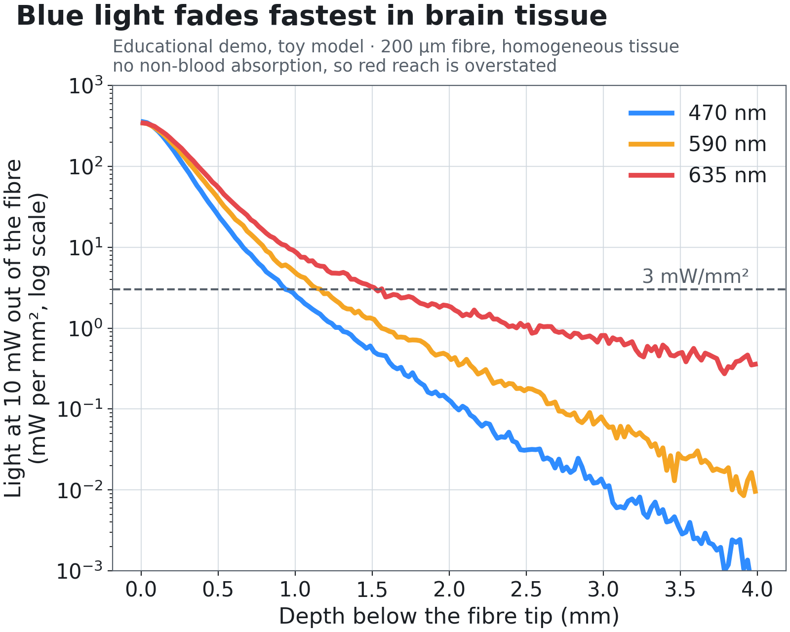
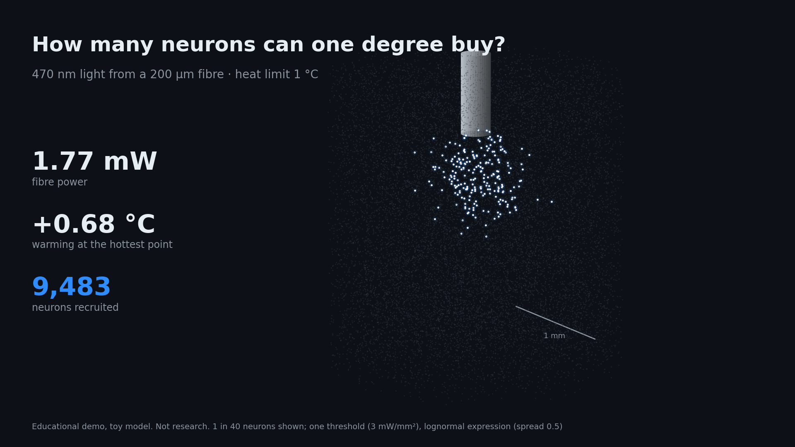

<p align="center">
  <picture>
    <source media="(prefers-color-scheme: dark)" srcset="assets/hero-dark.svg">
    <source media="(prefers-color-scheme: light)" srcset="assets/hero-light.svg">
    
  </picture>
</p>

> **Educational demos made to show an open-source tool. Not research, and not for any lab or clinical use.**

<p align="center"><b>Live:</b> <a href="https://faviovazquez.github.io/nobel-2026-lab/2026/medicine/video/interactive/">play the Medicine video that stops and asks</a> · <a href="https://faviovazquez.github.io/nobel-2026-lab/2026/medicine/page/">try the toy model</a> · <a href="https://faviovazquez.github.io/nobel-2026-lab/">the lab's site</a></p>

<p align="center">
  <a href="#what-is-this"><b>What is this</b></a> ·
  <a href="#the-prizes"><b>The prizes</b></a> ·
  <a href="#medicine-the-stations"><b>Medicine stations</b></a> ·
  <a href="#what-is-real-and-what-is-a-toy"><b>Real or toy?</b></a> ·
  <a href="#rerun-it-yourself"><b>Rerun it</b></a> ·
  <a href="#glossary"><b>Glossary</b></a>
</p>

## What is this

Every October the Nobel Prizes are announced. This repository turns each prize into a small learning lab. There is a plain-English fact sheet where every sentence has a source, a ledger of the exact claims we make, a few pictures, and, where it helps, a tiny model you can run on your own computer. Each prize gets its own folder. The demos exist to show an open-source video tool at work (it is credited at the bottom of this page). They are teaching toys. They are not science, and nothing here is a result.

## The prizes

| Prize | 2026 topic | Folder | Status |
|---|---|---|---|
| Medicine | Light-gated ion channels and optogenetics: Karl Deisseroth, Peter Hegemann, Georg Nagel | [2026/medicine](2026/medicine/README.md) | facts, claims ledger (27 claims), pictures, simulator, heat budget and interactive page done and independently reviewed; video done |
| Physics | Neutrino astronomy: Francis Halzen, for the IceCube Neutrino Observatory (announced 6 October) | none yet | coming |
| Chemistry | to be announced | none yet | coming |
| Economics | to be announced | none yet | coming |

The Nobel announcements run from 5 to 12 October 2026 ([nobelprize.org](https://www.nobelprize.org/prizes/medicine/2026/press-release/)). A folder is added only when its prize has been announced and its facts are sourced. The year index is in [2026/README.md](2026/README.md).

## Medicine: the stations

Think of five stops in a science museum. Each stop says what it is made of and whether it is ready.

<table>
  <tr>
    <td width="96" valign="top"></td>
    <td valign="top"><b>1. How the light switch works</b> <i>(ready)</i><br>
    An algal protein opens a pore when blue light hits it. A four-step drawing shows the light, the pore, the ions and the spike. See it below, or read the <a href="2026/medicine/README.md#the-story-in-14-lines">story</a>.</td>
  </tr>
  <tr>
    <td width="96" valign="top"></td>
    <td valign="top"><b>2. How deep light goes, and how much it heats</b> <i>(ready)</i><br>
    A toy model of light spreading through brain tissue from a fibre tip, and of the warmth it adds, for blue, amber and red light. Code and results: <a href="2026/medicine/simulator/README.md">simulator</a>.</td>
  </tr>
  <tr>
    <td width="96" valign="top"></td>
    <td valign="top"><b>3. The heat budget</b> <i>(ready)</i><br>
    How many neurons can one degree of warming buy you? A toy population of neurons, a fibre and a heat limit. Code and results: <a href="2026/medicine/heat-budget/README.md">heat-budget</a>.</td>
  </tr>
  <tr>
    <td width="96" valign="top"></td>
    <td valign="top"><b>4. The interactive page</b> <i>(ready)</i><br>
    A page in your browser: guess first, then see what the toy model says. <a href="https://faviovazquez.github.io/nobel-2026-lab/2026/medicine/page/">Try it online</a>, or open <a href="2026/medicine/page/index.html"><code>2026/medicine/page/index.html</code></a> after cloning (it needs no server).</td>
  </tr>
  <tr>
    <td width="96" valign="top"></td>
    <td valign="top"><b>5. The video</b> <i>(ready)</i><br>
    A 2:21 explainer of the prize, and a version that stops and asks you three questions. Every fact in it comes from the <a href="2026/medicine/CLAIMS.md">claims ledger</a>. <a href="https://faviovazquez.github.io/nobel-2026-lab/2026/medicine/video/interactive/">Play the version that asks</a>. Files and how it was made: <a href="2026/medicine/video/README.md">video</a>.</td>
  </tr>
</table>

<details>
<summary><b>Station 1 in pictures: how a light-gated channel works</b></summary>

<p align="center">
  <picture>
    <source media="(prefers-color-scheme: dark)" srcset="assets/diagram-light-gated-channel-dark.svg">
    <source media="(prefers-color-scheme: light)" srcset="assets/diagram-light-gated-channel-light.svg">
    
  </picture>
</p>

</details>


<details open>
<summary><b>Stations 2 and 3 in pictures</b></summary>

<p align="center">
  <picture>
    <source media="(prefers-color-scheme: dark)" srcset="2026/medicine/results/light_depth_profile_dark.png">
    
  </picture>
</p>

<p align="center">
  
</p>

</details>

## What is real, and what is a toy

<table>
  <tr>
    <th width="50%">Real</th>
    <th width="50%">A toy</th>
  </tr>
  <tr>
    <td valign="top">The prize, the people, the dates and the papers. Every sentence is sourced in <a href="2026/medicine/FACTS.md">FACTS.md</a> and checked in <a href="2026/medicine/CLAIMS.md">CLAIMS.md</a>.</td>
    <td valign="top">The light, heat and nerve-cell models. They use textbook ideas with simplified settings.</td>
  </tr>
  <tr>
    <td valign="top">The numbers we quote from published papers, such as a warming of 0.2 to 2 degrees Celsius reported in one study. Each has a link.</td>
    <td valign="top">Tissue is treated as one simple material. There is no skull, no blood vessels and no real brain shape. Each simulator README lists every simplification.</td>
  </tr>
  <tr>
    <td valign="top">The published parameters the models start from, each with its source.</td>
    <td valign="top">The outputs are for learning. They are not checked against experiments, and they must not be used to plan an experiment, a device or a treatment.</td>
  </tr>
</table>

## Rerun it yourself

Everything runs on an ordinary laptop processor, with no GPU and no accounts. After the one-time install it needs no network. Each folder has its own README with the exact steps, and that README is the reference.

- **Medicine:** [2026/medicine/README.md](2026/medicine/README.md) is the folder guide. The simulator's steps are in [2026/medicine/simulator/README.md](2026/medicine/simulator/README.md). In short, from `2026/medicine/`:

  ```bash
  python3.11 -m venv .venv && . .venv/bin/activate && pip install -r simulator/requirements.txt && python -m simulator.run_all
  ```

- Check every link, picture and source in this repository, offline: `python3 tools/check_links.py`
- Rebuild the pictures: `python3 tools/make_diagrams.py`

## Glossary

| Term | In plain English |
|---|---|
| Optogenetics | Using light to switch cells on or off, after giving them the gene for a light-sensitive protein. |
| Channelrhodopsin | A protein from algae that is both a light sensor and a channel: it opens a pore when light hits it. |
| Ion channel | A pore in a cell's outer membrane that lets charged particles through. |
| Ion | An atom or small molecule with an electric charge, such as sodium. |
| Action potential (spike) | The brief electrical pulse a nerve cell fires to pass on a signal. |
| Retinal | A small light-catching molecule that sits inside the protein and changes shape when it absorbs light. |
| Wavelength | The colour of light, measured in nanometres (nm). In this story, blue light is around 460 to 470 nm. |
| Scattering | Tissue bends light in all directions, so a beam fades and spreads as it goes deeper. |
| Viral vector | A modified virus used as a delivery van to carry a gene into chosen cells. |
| Toy model | A deliberately simple model that shows an idea. It is good for learning and not for decisions. |

## Licence and credit

MIT licence, see [LICENSE](LICENSE). Facts and quotations belong to their sources, which are linked next to every statement. This project is not affiliated with, or endorsed by, the Nobel Foundation, the Nobel Committee or anyone named in it.

Made with [showtime](https://github.com/FavioVazquez/showtime), a local video studio for coding agents.
