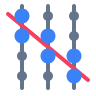
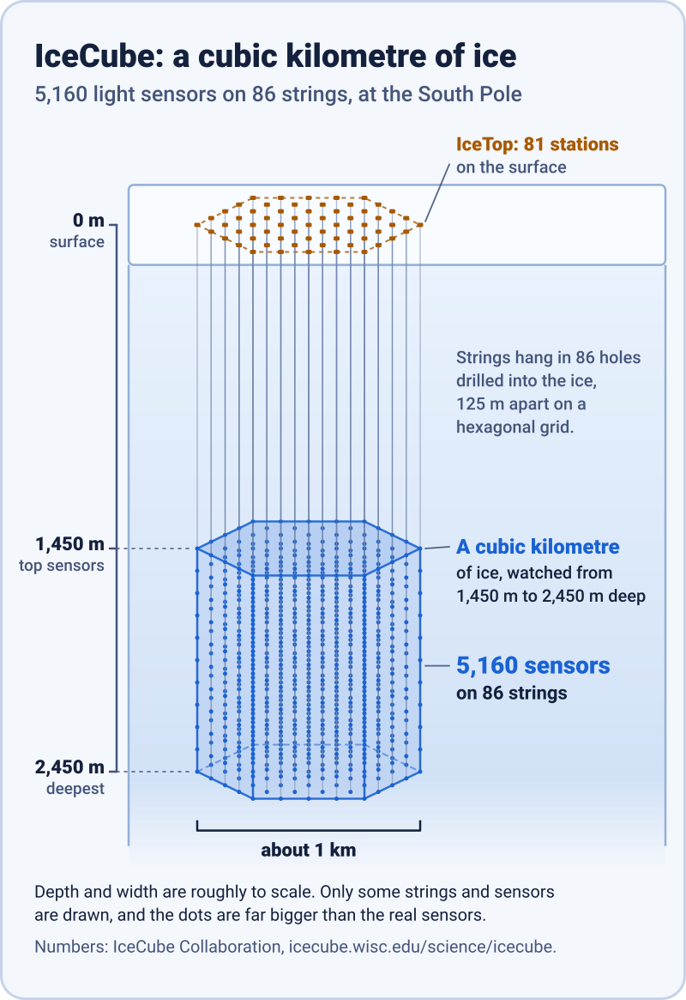
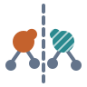
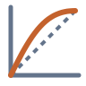
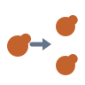
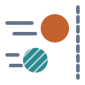
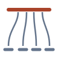
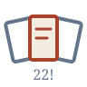
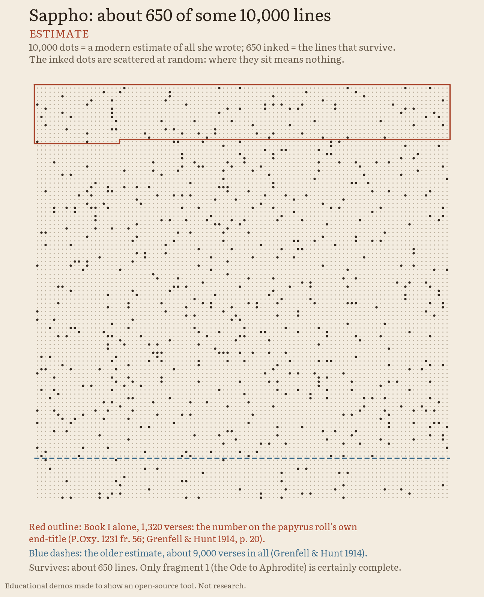

<p align="center">
  <picture>
    <source media="(prefers-color-scheme: dark)" srcset="assets/hero-dark.svg">
    <source media="(prefers-color-scheme: light)" srcset="assets/hero-light.svg">
    
  </picture>
</p>

> **Educational demos made to show an open-source tool. Not research, and not for any lab or clinical use.**

<p align="center"><b>Live:</b> <a href="https://faviovazquez.github.io/nobel-2026-lab/">the lab's site</a> · <a href="https://faviovazquez.github.io/nobel-2026-lab/2026/medicine/video/interactive/">the Medicine video that asks</a> · <a href="https://faviovazquez.github.io/nobel-2026-lab/2026/physics/video/interactive/">the Physics video that asks</a> · <a href="https://faviovazquez.github.io/nobel-2026-lab/2026/physics/glashow/">a real 6 PeV event in 3D</a> · <a href="https://faviovazquez.github.io/nobel-2026-lab/2026/chemistry/page/">the Chemistry page</a> · <a href="https://faviovazquez.github.io/nobel-2026-lab/2026/chemistry/video/exports/nobel-2026-chemistry.mp4">the Chemistry video</a> · <a href="https://faviovazquez.github.io/nobel-2026-lab/2026/literature/page/">the Literature page</a> · <a href="https://faviovazquez.github.io/nobel-2026-lab/2026/literature/video/exports/nobel-2026-literature.mp4">the Literature video</a></p>

<p align="center">
  <a href="#what-is-this"><b>What is this</b></a> ·
  <a href="#made-with-showtime"><b>Made with showtime</b></a> ·
  <a href="#the-prizes"><b>The prizes</b></a> ·
  <a href="#medicine-the-stations"><b>Medicine</b></a> ·
  <a href="#physics-the-stations"><b>Physics</b></a> ·
  <a href="#chemistry-the-stations"><b>Chemistry</b></a> ·
  <a href="#literature-the-stations"><b>Literature</b></a> ·
  <a href="#what-is-real-and-what-is-a-toy"><b>Real or toy?</b></a> ·
  <a href="#rerun-it-yourself"><b>Rerun it</b></a> ·
  <a href="#glossary"><b>Glossary</b></a>
</p>

## What is this

Every October the Nobel Prizes are announced. This repository turns each prize into a small learning lab, in its own folder. Each prize gets the same five things:

- **sourced facts:** a plain-English fact sheet where every sentence has a source;
- **a claims ledger:** the exact sentences we use, each with its source and the date it was checked;
- **toy models you can run** on your own computer;
- **a page that asks you to guess first**, then shows what the toy model says;
- **a short video** that tells the story; for Medicine and Physics, also a version that **stops and asks** you questions along the way.

They are teaching toys. They are not science, and nothing here is a result.

## Made with showtime

Every video in this lab, including the versions that stop and ask, was made with **[showtime](https://github.com/FavioVazquez/showtime)**, an open-source video studio for coding agents.

## The prizes

| Prize | 2026 topic | Folder | Status |
|---|---|---|---|
| Medicine | Light-gated ion channels and optogenetics: Karl Deisseroth, Peter Hegemann, Georg Nagel (announced 5 October) | [2026/medicine](2026/medicine/README.md) | done: facts, claims ledger (27 claims), toy models, page and video |
| Physics | Neutrino astronomy: Francis Halzen, for the IceCube Neutrino Observatory (announced 6 October) | [2026/physics](2026/physics/README.md) | done: facts, claims ledger (41 claims), toy models, a replay of a real event, page and video |
| Chemistry | Mirror-image molecules: Henri B. Kagan and Kenso Soai, for non-linear effects and autocatalysis in asymmetric synthesis (announced 7 October) | [2026/chemistry](2026/chemistry/README.md) | done: facts, claims ledger (39 claims), toy models, page and video |
| Literature | Anne Carson, "for her bold and inventive oeuvre that, in playful dialogue with the classical tradition, has created new forms for contemporary literature" (announced 8 October) | [2026/literature](2026/literature/README.md) | done: facts, claims ledger (72 claims), the survival ledger, fragments, translators, the forms shelf, page and video; independent review done, findings fixed |
| Economics | to be announced on 12 October | none yet | coming |

The Nobel announcements run from 5 to 12 October 2026 ([nobelprize.org](https://www.nobelprize.org/prizes/medicine/2026/press-release/)). A folder is added only when its prize has been announced and its facts are sourced. The year index is in [2026/README.md](2026/README.md).

## Medicine: the stations

The 2026 Nobel Prize in Physiology or Medicine went to Karl Deisseroth, Peter Hegemann and Georg Nagel, "for their discoveries concerning light-gated ion channels and optogenetics." Think of five stops in a science museum. Each stop says what it is made of and whether it is ready.

<table>
  <tr>
    <td width="96" valign="top"></td>
    <td valign="top"><b>1. How the light switch works</b> <i>(ready)</i><br>
    An algal protein opens a pore when blue light hits it. A four-step drawing shows the light, the pore, the ions and the spike. See it below, or read the <a href="2026/medicine/README.md#the-story-in-14-lines">story</a>.</td>
  </tr>
  <tr>
    <td width="96" valign="top"></td>
    <td valign="top"><b>2. How deep light goes, and how much it heats</b> <i>(ready)</i><br>
    A toy model of light spreading through brain tissue from a fibre tip, and of the warmth it adds, for blue, amber and red light. Code and results: <a href="2026/medicine/simulator/README.md">simulator</a>.</td>
  </tr>
  <tr>
    <td width="96" valign="top"></td>
    <td valign="top"><b>3. The heat budget</b> <i>(ready)</i><br>
    How many neurons can one degree of warming buy you? A toy population of neurons, a fibre and a heat limit. Code and results: <a href="2026/medicine/heat-budget/README.md">heat-budget</a>.</td>
  </tr>
  <tr>
    <td width="96" valign="top"></td>
    <td valign="top"><b>4. The interactive page</b> <i>(ready)</i><br>
    A page in your browser: guess first, then see what the toy model says. <a href="https://faviovazquez.github.io/nobel-2026-lab/2026/medicine/page/">Try it online</a>, or open <a href="2026/medicine/page/index.html"><code>2026/medicine/page/index.html</code></a> after cloning (it needs no server).</td>
  </tr>
  <tr>
    <td width="96" valign="top"></td>
    <td valign="top"><b>5. The video</b> <i>(ready)</i><br>
    A 2:21 explainer of the prize, and a version that stops and asks you three questions. Every fact in it comes from the <a href="2026/medicine/CLAIMS.md">claims ledger</a>. <a href="https://faviovazquez.github.io/nobel-2026-lab/2026/medicine/video/interactive/">Play the version that asks</a>. Files and how it was made: <a href="2026/medicine/video/README.md">video</a>.</td>
  </tr>
</table>

<details>
<summary><b>Station 1 in pictures: how a light-gated channel works</b></summary>

<p align="center">
  <picture>
    <source media="(prefers-color-scheme: dark)" srcset="assets/diagram-light-gated-channel-dark.svg">
    <source media="(prefers-color-scheme: light)" srcset="assets/diagram-light-gated-channel-light.svg">
    
  </picture>
</p>

</details>

<details open>
<summary><b>Stations 2 and 3 in pictures</b></summary>

<p align="center">
  <picture>
    <source media="(prefers-color-scheme: dark)" srcset="2026/medicine/results/light_depth_profile_dark.png">
    
  </picture>
</p>

<p align="center">
  
</p>

</details>

## Physics: the stations

The 2026 Nobel Prize in Physics went to Francis Halzen, "for decisive contributions to the IceCube Neutrino Observatory and the discovery of high-energy neutrinos of astrophysical origin." IceCube is a cubic kilometre of ice at the South Pole, watched by 5,160 light sensors on 86 strings. Six stops this time.

<table>
  <tr>
    <td width="96" valign="top"></td>
    <td valign="top"><b>1. How a neutrino telescope works</b> <i>(ready)</i><br>
    A neutrino from space almost never touches anything. Very rarely it hits the ice, and the light it makes reaches sensors hanging on strings. A four-step drawing shows how: see it below.</td>
  </tr>
  <tr>
    <td width="96" valign="top"></td>
    <td valign="top"><b>2. Build a neutrino telescope</b> <i>(ready)</i><br>
    A toy neutrino telescope on a laptop: a muon, its light, the sensor hits and a fit of its direction. Then one question: how much worse does the aim get if the strings are spaced further apart? Code and results: <a href="2026/physics/telescope/README.md">telescope</a>.</td>
  </tr>
  <tr>
    <td width="96" valign="top"></td>
    <td valign="top"><b>3. Why a cubic kilometre</b> <i>(ready)</i><br>
    Neutrinos from space are rare and seldom hit anything, so the detector has to be huge to catch a few. Three small toy calculations ask why it had to be that big. Code and results: <a href="2026/physics/kilometre/README.md">kilometre</a>.</td>
  </tr>
  <tr>
    <td width="96" valign="top"></td>
    <td valign="top"><b>4. The real 6 PeV event, replayed</b> <i>(ready)</i><br>
    On 8 December 2016 IceCube recorded a particle shower of about 6 PeV (6 million billion electronvolts). A page replays IceCube's public data for it in 3D, in your browser, every light pulse at its recorded time. <a href="https://faviovazquez.github.io/nobel-2026-lab/2026/physics/glashow/">Open the replay</a>. Sources and files: <a href="2026/physics/glashow/README.md">glashow</a>.</td>
  </tr>
  <tr>
    <td width="96" valign="top"></td>
    <td valign="top"><b>5. The interactive page</b> <i>(ready)</i><br>
    Guess first, then see what the toy models say: the odds that a neutrino hits the ice, how big a detector has to be, and how far apart the strings can go. <a href="https://faviovazquez.github.io/nobel-2026-lab/2026/physics/page/">Try it online</a>, or open <a href="2026/physics/page/index.html"><code>2026/physics/page/index.html</code></a> after cloning (it needs no server).</td>
  </tr>
  <tr>
    <td width="96" valign="top"></td>
    <td valign="top"><b>6. The video</b> <i>(ready)</i><br>
    An explainer of the prize, and a version that stops and asks. Every fact in it comes from the <a href="2026/physics/CLAIMS.md">claims ledger</a>. <a href="https://faviovazquez.github.io/nobel-2026-lab/2026/physics/video/interactive/">Play the version that asks</a>. Files and how it was made: <a href="2026/physics/video/README.md">video</a>.</td>
  </tr>
</table>

<details open>
<summary><b>Stations 1 and 3 in pictures: how a neutrino telescope works, and IceCube roughly to scale</b></summary>

<p align="center">
  <picture>
    <source media="(prefers-color-scheme: dark)" srcset="assets/diagram-neutrino-telescope-dark.svg">
    <source media="(prefers-color-scheme: light)" srcset="assets/diagram-neutrino-telescope-light.svg">
    
  </picture>
</p>

<p align="center">
  <picture>
    <source media="(prefers-color-scheme: dark)" srcset="assets/diagram-icecube-scale-dark.svg">
    <source media="(prefers-color-scheme: light)" srcset="assets/diagram-icecube-scale-light.svg">
    
  </picture>
</p>

</details>

## Chemistry: the stations

The 2026 Nobel Prize in Chemistry went to Henri B. Kagan and Kenso Soai, "for the discovery of non-linear effects and autocatalysis in asymmetric organic synthesis." Many molecules come in two mirror-image forms, like a left and a right hand, and life uses only one. Kagan and Soai showed how a reaction can be made to choose one hand. Six stops; the details are in [2026/chemistry](2026/chemistry/README.md).

<table>
  <tr>
    <td width="96" valign="top"></td>
    <td valign="top"><b>1. Mirror molecules</b> <i>(ready)</i><br>
    Your hands, and the amino acid alanine, next to their mirror images. Life uses one hand. See it below.</td>
  </tr>
  <tr>
    <td width="96" valign="top"></td>
    <td valign="top"><b>2. Kagan's curve</b> <i>(ready)</i><br>
    Mix both hands in a catalyst and the product's lead of one hand (ee) bends away from the straight line. In our toy model (trend only), the committee's 75:25 ligand, a 50% lead, gives a product with an 80% lead. Code and results: <a href="2026/chemistry/kagan-curve/README.md">kagan-curve</a>.</td>
  </tr>
  <tr>
    <td width="96" valign="top"></td>
    <td valign="top"><b>3. Soai's amplifier</b> <i>(ready)</i><br>
    A molecule that copies its own hand: published kinetic models set against Soai's 2003 numbers. In our toy model (trend only), pairs formed at random (K = 4) would need about 1.7 million turnovers to reach Soai's 57%; a fitted toy (K = 73) gives 57%, 99%, then 99.98%. Code and results: <a href="2026/chemistry/soai-amplifier/README.md">soai-amplifier</a>.</td>
  </tr>
  <tr>
    <td width="96" valign="top"></td>
    <td valign="top"><b>4. The mirror race</b> <i>(ready)</i><br>
    Frank's 1953 model, run molecule by molecule from an exact 50:50 start, 10,000 times. In our toy model (trend only, for our chosen rates), copying alone gives a flat spread; with mutual antagonism 99.7% of runs end with a lead past 90%, about half for each hand. Code and results: <a href="2026/chemistry/mirror-race/README.md">mirror-race</a>.</td>
  </tr>
  <tr>
    <td width="96" valign="top"></td>
    <td valign="top"><b>5. The interactive page</b> <i>(ready)</i><br>
    Guess first, then see what the toy models say. <a href="https://faviovazquez.github.io/nobel-2026-lab/2026/chemistry/page/">Try it online</a>, or open <a href="2026/chemistry/page/index.html"><code>2026/chemistry/page/index.html</code></a> after cloning.</td>
  </tr>
  <tr>
    <td width="96" valign="top"></td>
    <td valign="top"><b>6. The video</b> <i>(ready)</i><br>
    A 2:30 explainer that tells the story, from Frank's recipe to Kagan's bend, Soai's copier and our mirror race; it asks no questions. Every fact in it comes from the <a href="2026/chemistry/CLAIMS.md">claims ledger</a>. <a href="2026/chemistry/video/exports/nobel-2026-chemistry.mp4">Watch the MP4</a>. Files and how it was made: <a href="2026/chemistry/video/README.md">video</a>.</td>
  </tr>
</table>

<details open>
<summary><b>Station 1 in pictures: mirror molecules</b></summary>

<p align="center">
  <picture>
    <source media="(prefers-color-scheme: dark)" srcset="assets/diagram-mirror-hands-dark.svg">
    <source media="(prefers-color-scheme: light)" srcset="assets/diagram-mirror-hands-light.svg">
    
  </picture>
</p>

</details>

## Literature: the stations

The 2026 Nobel Prize in Literature went to the Canadian author Anne Carson, "for her bold and inventive oeuvre that, in playful dialogue with the classical tradition, has created new forms for contemporary literature". The classical tradition she answers reaches us mostly lost, or in pieces. Six stops: what survives, how it survives, how translators carried it, and the new forms of her books. Every ancient text shown (Greek, Latin and the old English versions) is public domain, with its source; there is no likeness of her and no cover art. The details are in [2026/literature](2026/literature/README.md).

<table>
  <tr>
    <td width="96" valign="top"></td>
    <td valign="top"><b>1. The survival ledger</b> <i>(ready)</i><br>
    How much survives of the ancient authors the Nobel Committee names. Of Sophocles' plays, more than 120 by modern estimate, seven survive complete; Sappho wrote an estimated 9,000 to 10,000 lines, and about 650 survive. Ancient testimony and modern estimates side by side, as ranges, each with its sources. Code and results: <a href="2026/literature/survival-ledger/README.md">survival-ledger</a>.</td>
  </tr>
  <tr>
    <td width="96" valign="top"></td>
    <td valign="top"><b>2. Where the words went</b> <i>(ready)</i><br>
    Three ways a Sappho poem is lost: a torn papyrus, where 95 of 483 printed letters are the 1914 editors' restorations; a quotation that stops after the first line of a fifth stanza; and fragments of a few words (in Wharton's 1908 edition the median has 7 Greek words, and about a third have 5 or fewer). Code and results: <a href="2026/literature/fragments/README.md">fragments</a>.</td>
  </tr>
  <tr>
    <td width="96" valign="top"></td>
    <td valign="top"><b>3. One poem, 2,000 years of translators</b> <i>(ready)</i><br>
    Sappho 31 and six public-domain versions, from Catullus' Latin to Wharton's English prose of 1885, word by word: three keep her opening "seems to me", two open "Blest as the immortal gods is he". Our rough count, not a quality score. Code and results: <a href="2026/literature/translators/README.md">translators</a>.</td>
  </tr>
  <tr>
    <td width="96" valign="top"></td>
    <td valign="top"><b>4. The forms shelf</b> <i>(ready)</i><br>
    The 49 entries of the Committee's bibliography ("a selection") by the forms they name; <i>Float</i>'s 22 chapbooks and their 22! orders; and the prize's own history from the Nobel API: 123 laureates, 19 women, and the second Canadian after Alice Munro. Code and results: <a href="2026/literature/forms/README.md">forms</a>.</td>
  </tr>
  <tr>
    <td width="96" valign="top"></td>
    <td valign="top"><b>5. The interactive page</b> <i>(ready)</i><br>
    Guess first, then see: lost plays on ink shelves, the torn papyrus with a slider for the restorations, the threads of one Greek stanza through six versions, and the forms shelf. <a href="https://faviovazquez.github.io/nobel-2026-lab/2026/literature/page/">Try it online</a>, or open <a href="2026/literature/page/index.html"><code>2026/literature/page/index.html</code></a> after cloning.</td>
  </tr>
  <tr>
    <td width="96" valign="top"></td>
    <td valign="top"><b>6. The video</b> <i>(ready)</i><br>
    A 2:29 explainer drawn in ink that tells the story, from the citation to a torn papyrus, one Sappho poem through its translators and her new forms; it asks no questions. Every fact in it comes from the <a href="2026/literature/CLAIMS.md">claims ledger</a>. <a href="2026/literature/video/exports/nobel-2026-literature.mp4">Watch the MP4</a>. Files and how it was made: <a href="2026/literature/video/README.md">video</a>.</td>
  </tr>
</table>

<details open>
<summary><b>Station 1 in pictures: what survives of Sappho</b></summary>

<p align="center">
  <picture>
    <source media="(prefers-color-scheme: dark)" srcset="2026/literature/survival-ledger/results/sappho_grid_dark.png">
    
  </picture>
</p>

</details>

## What is real, and what is a toy

<table>
  <tr>
    <th width="16%"></th>
    <th width="42%">Real</th>
    <th width="42%">A toy</th>
  </tr>
  <tr>
    <td valign="top"><b>Every prize</b></td>
    <td valign="top">The prize, the people, the dates and the papers. Every sentence is sourced in the prize's FACTS.md and checked in its CLAIMS.md: <a href="2026/medicine/CLAIMS.md">Medicine</a>, <a href="2026/physics/CLAIMS.md">Physics</a>, <a href="2026/chemistry/CLAIMS.md">Chemistry</a>, <a href="2026/literature/CLAIMS.md">Literature</a>.</td>
    <td valign="top">Every model we built. The outputs are for learning. They are not checked against experiments, and they must not be used to plan an experiment, a device or a treatment. Each model's README lists every simplification.</td>
  </tr>
  <tr>
    <td valign="top"><b>Medicine</b></td>
    <td valign="top">The numbers we quote from published papers, such as a warming of 0.2 to 2 degrees Celsius reported in one study, and the published parameters the models start from. Each has a link.</td>
    <td valign="top">The light, heat and nerve-cell models. Tissue is treated as one simple material. There is no skull, no blood vessels and no real brain shape.</td>
  </tr>
  <tr>
    <td valign="top"><b>Physics</b></td>
    <td valign="top">IceCube's published results and numbers, such as the size of the detector and the energy of the 6 PeV event, each with a link to its paper or page. The public event data in the 3D replay: IceCube's own data release for that event (DOI <a href="https://doi.org/10.21234/gr2021">10.21234/gr2021</a>), replayed at its recorded times. The drawing is ours, not an official IceCube visualisation.</td>
    <td valign="top">Our light, detector and rate models: how the particles make light and how it travels through the ice; simplified strings, sensors and ice; and how many neutrinos a toy detector would catch. They are not predictions, and they are not IceCube results.</td>
  </tr>
  <tr>
    <td valign="top"><b>Chemistry</b></td>
    <td valign="top">The published numbers we quote, such as the Nobel Committee's 75:25 worked example and Soai's 2003 runs (about 0.00005%, then 57%, 99% and more than 99.5%), each with its source in the ledger. Textbook level only: no lab procedures, amounts or conditions anywhere.</td>
    <td valign="top">Kagan's curve, Soai's amplifier and the mirror race: published mathematical models with numbers we chose. They show the shape of the ideas. They are not the laureates' results, and they do not explain how life chose its hand.</td>
  </tr>
  <tr>
    <td valign="top"><b>Literature</b></td>
    <td valign="top">The Committee's words about her books, the Nobel API's counts, and the ancient texts: Greek, Latin and English as public-domain editions printed them (Wharton 1908, Grenfell and Hunt 1914, and the translators Wharton prints), byte for byte, each with its page. Ancient testimony and modern estimates of what survives, each with its sources.</td>
    <td valign="top">Not a toy model but our own counts and drawings: the ink shelves and the 10,000-dot grid (estimates), the letters and words counted in old editions, and a hand alignment of six versions of one poem, our rough count, not a quality score. Nothing here is literary criticism, and none of it ranks a translator.</td>
  </tr>
</table>

## Rerun it yourself

Everything runs on an ordinary laptop processor, with no GPU and no accounts. After the one-time install it needs no network. Each folder has its own README with the exact steps, and that README is the reference.

- **Medicine**, the light and heat simulator, from `2026/medicine/` ([steps](2026/medicine/simulator/README.md)):

  ```bash
  python3.11 -m venv .venv && . .venv/bin/activate && pip install -r simulator/requirements.txt && python -m simulator.run_all
  ```

- **Physics**, build a neutrino telescope, a quick run from `2026/physics/telescope/` ([steps](2026/physics/telescope/README.md); the full published run is much bigger, and its README says how long it takes):

  ```bash
  python3 -m venv .venv && . .venv/bin/activate && pip install -r requirements.txt && python -m telescope.run_all --quick --workers 4
  ```

- **Physics**, why a cubic kilometre, from `2026/physics/kilometre/` ([steps](2026/physics/kilometre/README.md); its optional cross-checks download public IceCube files):

  ```bash
  python3.11 -m venv .venv && . .venv/bin/activate && pip install -r requirements.txt && python -m whykm.run_all
  ```

- **Physics**, the 6 PeV replay: rebuilt from IceCube's data release, see [glashow](2026/physics/glashow/README.md).
- **Chemistry**, Kagan's curve, Soai's amplifier and the mirror race: each runs in seconds, from its own folder; the steps are in [2026/chemistry](2026/chemistry/README.md#rerun-and-check).
- **Literature**, the survival ledger, the fragments, the translators and the forms shelf: each runs in seconds, from its own folder; the steps are in [2026/literature](2026/literature/README.md#rerun-and-check).
- The pages need nothing: open `2026/medicine/page/index.html`, `2026/physics/page/index.html`, `2026/chemistry/page/index.html` or `2026/literature/page/index.html` in a browser.
- Check every link, picture and source in this repository, offline: `python3 tools/check_links.py`
- Rebuild the pictures: `python3 tools/make_diagrams.py`

## Glossary

| Term | In plain English |
|---|---|
| Optogenetics | Using light to switch cells on or off, after giving them the gene for a light-sensitive protein. |
| Channelrhodopsin | A protein from algae that is both a light sensor and a channel: it opens a pore when light hits it. |
| Ion channel | A pore in a cell's outer membrane that lets charged particles through. |
| Ion | An atom or small molecule with an electric charge, such as sodium. |
| Action potential (spike) | The brief electrical pulse a nerve cell fires to pass on a signal. |
| Retinal | A small light-catching molecule that sits inside the protein and changes shape when it absorbs light. |
| Wavelength | The colour of light, measured in nanometres (nm). In this story, blue light is around 460 to 470 nm. |
| Scattering | Tissue bends light in all directions, so a beam fades and spreads as it goes deeper. |
| Viral vector | A modified virus used as a delivery van to carry a gene into chosen cells. |
| Neutrino | A particle with no electric charge and almost no mass. It seldom collides with anything, so neutrinos pass all the way through the Earth, and through us, without us noticing. |
| IceCube | A neutrino telescope: a cubic kilometre of ice at the South Pole, watched by 5,160 light sensors on 86 strings. |
| Cherenkov light | The faint blue light given off by a charged particle that moves through ice faster than light travels in ice. It is what IceCube's sensors record. |
| PeV | Petaelectronvolt, a unit of energy: a million billion electronvolts. The event in station 4 had about 6 PeV. |
| Sigma (σ) | A way to say how unlikely a result would be if it were only chance. More sigma means less likely to be a fluke. The Nobel Committee's texts call 5 sigma the threshold for a discovery. |
| Chirality | Handedness. A chiral molecule differs from its mirror image, like a left and a right hand: you cannot lay one on top of the other. |
| Enantiomer | One of the two mirror-image forms of a chiral molecule. |
| ee (enantiomeric excess) | How far a mix of the two forms is from 50:50: the share of one form minus the share of the other. A 50:50 mix has 0%, one form alone 100%. |
| Autocatalysis | A reaction whose product speeds up its own formation. In Soai's reaction, the product copies its own hand. |
| Non-linear effect | When the product's ee is not in proportion to the catalyst's ee: the curve bends away from the straight line. Kagan found it in 1986. |
| Homochiral | Of one hand only. Life is homochiral: the amino acids in our proteins are all one mirror form. |
| Toy model | A deliberately simple model that shows an idea. It is good for learning and not for decisions. |
| Fragment | A piece of an ancient text that survives without the rest: a scrap of papyrus, or a few lines quoted by a later writer. |
| Papyrus | A writing sheet made from the papyrus plant. Many lost Greek texts were found on papyrus scraps in Egypt, at Oxyrhynchus. |
| Restoration | Letters an editor fills into a hole in a papyrus, printed inside square brackets: a guess, not the ancient author's words. |

## Licence and credit

MIT licence, see [LICENSE](LICENSE). Facts and quotations belong to their sources, which are linked next to every statement. This project is not affiliated with, or endorsed by, the Nobel Foundation, the Nobel Committee, the IceCube Collaboration or anyone named in it.

Data used by the Physics demos:

- The 6 PeV event: IceCube Collaboration, data release for the Glashow resonance event, DOI [10.21234/gr2021](https://doi.org/10.21234/gr2021).
- The positions of IceCube's 5,160 sensors: derived from IceCube's ppc geometry, Zenodo [10.5281/zenodo.10410725](https://doi.org/10.5281/zenodo.10410725), CC-BY-4.0.
- Neutrino cross sections and the Earth model: the nuFATE tables (Vincent, Argüelles, Kheirandish, [arXiv:1706.09895](https://arxiv.org/abs/1706.09895)), MIT licence.

Data used by the Literature demos:

- The Nobel Prize API v2.1, CC0; the Nobel Committee's texts are quoted with attribution.
- Public-domain editions: H. T. Wharton, *Sappho* (1908, [Project Gutenberg #57390](https://www.gutenberg.org/ebooks/57390)); Grenfell and Hunt, *The Oxyrhynchus Papyri* X (1914, [archive.org](https://archive.org/details/oxyrhynchuspapyr10gren)); Rhys Roberts, *Longinus On the Sublime* (1899).
- Word glosses from LSJ, Perseus Digital Library, CC BY-SA 4.0 ([PerseusDL/lexica](https://github.com/PerseusDL/lexica)); fragment numbers (numbers only) from [The Digital Sappho](https://digitalsappho.org/), CC BY-SA 4.0. The Suda On Line is cited, not copied.

Every video here was made with [showtime](https://github.com/FavioVazquez/showtime), an open-source video studio for coding agents.
